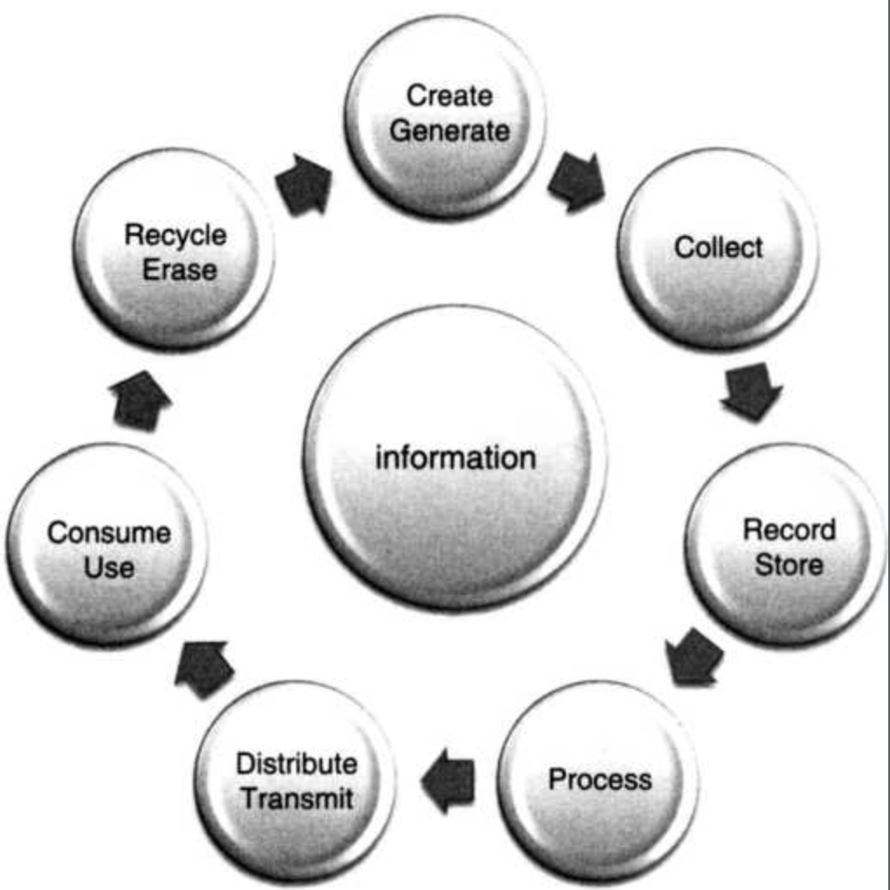

# Informacja: wstęp

Warren Weaver supported a tripartite analysis of information in terms of

1\) technical problems concerning the quantification of information and dealt with by Shannon's theory;

2\) semantic problems relating to meaning and truth; and

3\) what he called \`influential' problems concerning the impact and effectiveness of information on human behaviour, which he thought had to play an equally important role.

## Infosfera

Historyczność, zdaniem Floridiego, równoznaczna jest z możliwością zapisywania informacji o przeszłości. Historia jest synonimem epoki informacji.

> „What all these and many other metrics have in common is that they are all historical, in the strict sense that they all depend on the development of systems to record events and hence accumulate and transmit information about the past. No records, no history, so history is actually synonymous with the information age, since prehistory is that age in human development that precedes the availability of recording systems.”

Cykl życia informacji prezentuje się następująco:

1. Pojawienie się \(_occurence_\): \(odkrycie, zaprojektownie, stworzenie, _authoring,_ etc._\)_
2. Transmisja/przekazanie: \(networking, distributing, accessing, retrieving, transmitting, etc.\)
3. Przetwarzanie i zarządzanie: \(collecting, validating, modifying, organizing, indexing, classifying, filtering, updating, sorting, storing, etc.\)
4. Użycie: \(monitoring, modelling, analysing, explaining, planning, forecasting, decision-making, instructing, educating, learning, etc.\)

zapisywanie informacji -&gt; system komunikacyjny \(post-gutenberg\) -&gt; system przetwarzający i produkujący \(post-turing\)

Floridi i teza o inforgach i infosferze:

> „In many respects, we are not standalone entities, but rather interconnected informational organisms or inforgs, sharing with biological agents and engineered artefacts a global environment ultimately made of information, the infosphere. This is the informational environment constituted by all informational processes, services, and entities, thus including informational agents as well as their properties, interactions, and mutual relations.”

Data shadow: digital alter-ego

> „\[ICTs\] are radically transforming devices because they engineer environments that the user is then enabled to enter through \(possibly friendly\) gateways, experiencing a form of initiation. There is no term for this radical form of re-engineering, so we may use re-ontologizing as a neologism to refer to a very radical form of re-engineering, one that not only designs, constructs, or structures a system \(e.g. a company, a machine, or some artefact\) anew, but that fundamentally transforms its intrinsic nature, that is, its ontology. In this sense, ICTs are not merely re-engineering but actually re-ontologizing our world.”

Human-Computer Interaction is a symmetric relation. Douglas Engelbart, kiedy projektował swoją myszkę, na początku myślał o umieszczeniu czegoś na podłodze, dzięki czemu bylibyśmy w stanie operować komputerem bez użycia rąk.

> „We are modifying our everyday perspective on the ultimate nature of reality, that is, our metaphysics, from a materialist one, in which physical objects and processes play a key role, to an informational one. This shift means that objects and processes are de-physicalized in the sense that they tend to be seen as support-independent \(consider a music file\). They are typified, in the sense that an instance of an object \(my copy of a music file\) is as good as its type \(your music file of which my copy is an instance\). And they are assumed to be by default perfectly clonable, in the sense that my copy and your original become interchangeable.”

I kolejny, dotyczący natury, sposobu użycia:

> „Less stress on the physical nature of objects and processes means that the right of usage is perceived to be at least as important as the right to ownership.”

Informacyjne kryterium ontologiczne: istnieje wszystko to, z czym mogę podjąć interakcję.

> „Finally, the criterion for existence - what it means for something to exist - is no longer being actually immutable \(the Greeks thought that only that which does not change can be said to exist fully\), or being potentially subject to perception \(modern philosophy insisted on something being perceivable empirically through the five senses in order to qualify as existing\), but being potentially subject to interaction, even if intangible.”

KK&gt; Zagadnienie bycia identycznym wirtualnie: to jest trochę kwestia platońska, zdaje mi się - zwłaszcza w kontekście tworzenia i umocowywania marki. Mam prawo do Whoopera. Whooper jako typ, tak jak typem jest Char albo Integer.  
Inkarnacja - embodied into flesh, stanie się materią. 

Ciekawy problem z tożsamością osobową \(ciekawe, jak można byłoby ten wątek rozwinąć w kontekście Begerowskiej narracji o obrazach\):

> „Once our window-shopping becomes Windows-shopping, and no longer means walking down the street but browsing through the Web, our sense of personal identity starts being eroded as well. Instead of individuals as unique and irreplaceable entities, we become mass-produced, anonymous entities among other anonymous entities, exposed to billions of other similar informational organisms online. So we self-brand and re-appropriate ourselves in the infosphere by using blogs and Facebook entries, homepages, YouTube videos, and flickr albums. ”

Infosfera absorbuje każdą inną przestrzeń.

