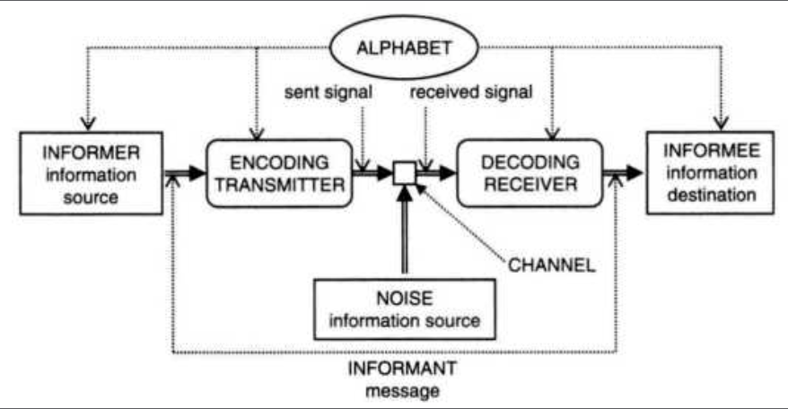
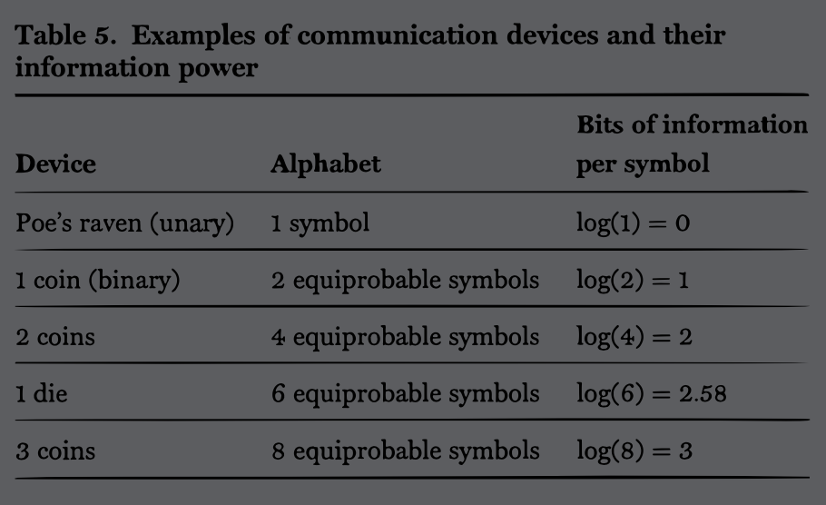

# Matematyczna teoria informacji

## Matematyczna teoria komunikacji

MTK traktuje informację jako komunikację danych, z naciskiem na efektywność i kodowanie przekazywania danych.



Jednoargumentowe urządzenie \(_unary device_\): urządzenie, które zawsze udziela tej samej odpowiedzi. Kruk z opowiadania Edgara Alana Poe, który zawsze odpowiada 'nevermore'. Dla Platona, takim urządzeniem był tekst, albo obraz.

Tak samo jak chłopiec, co wywoływał wilka z lasu, aż w końcu wilk przyszedł, ale wówczas chłopiec był już w roli _uniformative unary device_.

Mateusz 5:37:

```text
coin = {h,t}

State 0 = uncertainty;
toss(coin);
State 1 = h //= 1 bit
```

> „In the AB system, the occurrence of each symbol  removes a higher data deficit than the occurrence of a symbol in theA system. In other words, each symbol provides more information by excluding more alternatives.”



## Redundancja i szum

Kompresja służy do zredukowania redundancji, redundancja zaś pomaga znosić dwuznaczności i szum.

**A message + noise contains more data than the original message by itself.**  
KK&gt; i to jest bardzo ciekawy zapis. Jak odciążyć aparat poznawczy użytkownika, w jaki sposób zaprojektować przekaz tak, żeby zniwelować szum. Na pewno poprzez dopasowywanie modelu mentalnego do modelu konceptualnego urządzenia.

Najważniejsza jednak jest wierność przekazu, nie wzrost danych - to nie powinno stanowić problemu.

> „We are more likely to reconstruct a message correctly at the end of the transmission if some degree of redundancy counterbalances the inevitable noise and equivocation introduced by the physical process of communication and the environment. Noise extends the informee's freedom of choice in selecting a message, but it is an undesirable freedom and some redundancy can help to limit it.”

## Model matematyczny informacji

Informacja w rozumieniu matematycznym zawsze sprowadza się do pytania zerojedynkowego. Niesie to ze sobą następujące konsekwencje:

> „First, MTC is not a theory of information in the ordinary sense of the word. In MTC, information has an entirely technical meaning.”

Zazwyczaj jest tak, że pewien ciąg znaków, mimo że składa się z kilku bitów z matematycznego punktu widzenia, przekazuje jeden bit informacji - odpowiedź tak lub nie. Jak w tekstach piosenek tuż przed lądowaniem w Normandii, które niosły za sobą dodatkowe znaczenie.

> „According to MTC, the classic monkey randomly pressing typewriter keys is indeed producing a lot of information.”

I dalej

> „Second, since MTC is a theory of information without meaning \(not in the sense of meaningless, but in the sense of not yet meaningful\), and since \[information - meaning = data\], 'mathematical theory of data communication' is a far more appropriate description of this branch of probability theory than 'information theory'.

To nie jest kwestia opisu. Informacja, jako treść semantyczna, może być również opisana jako dane+zapytania \(_data+queries_\):

> Imagine a piece of information such as `the earth has only one moon.`It is easy to polarize almost all its semantic content by transforming it into a `[query + binary answer]`, such as `[does the earth have only one moon? + yes]`. Subtract the `yes` - which is at most one bit of information - and you are left with all the semantic content, with all the indications of its truth or falsity removed.

`yes` w tym przypadku funkcjonuje jako klucz, który odblokowuje informację zawartą w zapytaniu. 

> MTC studies the codification and transmission of information by treating it as data keys, that is, as the amount of detail in a signal or message or memory space necessary to saturate the informee's unsaturated information.

Weaver:

> the word information relates not so much to what you do say, as to what you could say. The mathematical theory of communication deals with the carriers of information, symbols and signals, not with information itself. That is, **information is the measure of your freedom of choice when you select a message**.

Matematyczna teoria komunikacji głównie zajmuje się badaniem informacji na syntaktycznym poziomie. A ponieważ komputery to maszyny syntaktyczne, dlatego tak to działa.

## Entropia i losowość


