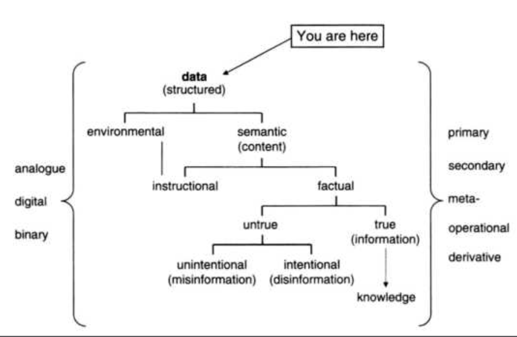

# Słownik informacji

## The data-based definition of information



General Definition of Information \(GDI\) = Data + Meaning

```text
GDI:
σ is an instance of information, understood as semantic content, if and only if:
    GDI 1.) σ consists of n data, for n >= 1;
    GDI 2.) the data are well formed;
    GDI 3.) the well formed data are meaningful 
```

GDI 2: _well formed_ oznaczają, że dane są sformatowane zgodnie z obowiązującą gramatyką \(_syntax_\).

GDI 3: \`Meaningful' means that the data must comply with the meanings \(semantics\) of the chosen system, code, or language in question.

> „How data can come to have an assigned meaning and function in a semiotic system like a natural language is one of the hardest questions in semantics, known as the **symbol grounding problem**.”

KK&gt; z tej perspektywy, mamy do czynienia z wymiarowością danych - dane jednowymiarowe, jak np. tytuł kolumny, dane dwuwymiarowe \(tytuł kolumny + tytuł wiersza\), dane trójwymiarowe \(kolumna, wiersz, _rząd_ \(?\)\) itede

## Dane

Żeby zrozumieć, czym są dane, warto je zaatakować z perspektywy wymazania, uszkodzenia lub ich utracenia.

Dane = brak jednolitości.   
KK&gt; Dane: czynnik różnicujący?

> „Donald MacCrimmon MacKay \(1922-1987\) highlighted this important point when he wrote that  `information is a distinction that makes a difference'. He was followed by Gregory Bateson (1904-1980), whose slogan is better known, although less accurate:`In fact, what we mean by information - the elementary unit of information - is a difference which makes a difference'.

```text
datum: 

x being distinct from y, 
where x and y are two uniterpreted variables
and
the relation of 'being distinct',
as well as the domain,
are left open to further interpretation
```

\(1\) Po pierwsze, dane to brak jednolitości \(_lack of uniformity_\) w rzeczywistości.

Dedomena \(Δεδομένα\): dane, które nie są zinterpretowane lub nie są przedmiotem procesów poznawczych.

> „They are not experienced directly, but their presence is empirically inferred from, and required by, experience, since they are what has to be there in the world for our information to be possible at all. So dedomena are whatever lack of uniformity in the world is the source of \(what looks to informational organisms like us as\) data, e.g. a red light against a dark background.”

\(2\) Po drugie, dane to brak jednolitości pomiędzy \(percepcją\) co najmniej dwóch fizycznych stanów systemu lub sygnałów. **· & -** w alfabecie Morse'a

\(3\) Po trzecie, dane to brak jednolitości pomiędzy dwoma symbolami, np. literami F i P w alfabecie łacińskim.

W zależności od interpretacji, dedomena \(1\) może być albo identyczna z sygnałem \(2\) albo z czymś, co ten sygnał umożliwia \(2\) \(kantowska interpretacja dedomeny\). Sygnały zaś \(2\) są tym, co umożliwia kodowanie symboli \(3\).

## Bity

1.

> „First, bits can equally well be represented semantically \(meaning True/False\), logico-mathematically \(standing for 1/0\), and physically \(transistor = On/Off; switch = Open/Closed; electric circuit = High/Low voltage; disc or tape = Magnetized/ Unmagnetized; CD = presence/absence of pits, etc.\), and hence **provide the common ground where semantics, mathematical logic, and the physics and engineering of circuits and information theory can converge**.”

2.

> „This means \(second advantage\) that **it is possible to construct machines that can recognize bits physically, behave logically on the basis of such recognition, and therefore manipulate data in ways which we find meaningful**.”

3.

> „Since digital data normally have only two states, such discrete variation means that a computer will hardly ever get confused about what needs to be processed, unlike an analogue machine, which can often perform unsatisfactorily or imprecisely. Above all, a digital machine can recognize if some data are incomplete and hence recover, through mathematical calculations, data that may have got lost if there is something literally odd about the quantity of bits it is handling.”

## Typy danych

1. Primary data: domyślnie, dane, o które nam chodzi. 
2. Secondary data: dane towarzyszące, uzyskujące znacznie, na podstawie innych danych. Kluczowym przykładem będzie tu na przykład cisza, przerwa, pauza.
3. Metadane \(_metadata_\): nadają znaczenie danym, oznaczają dane, przeważnie _primary_ _data_.
4. Dane operacyjne \(_operational data_\): dane dotyczące operowania i zachowania się systemu
5. _Derivative data_: dane wypracowywane na podstawie istniejących już danych, np. na podstawie danych, że ktoś dokonywał zakupu benzyny na stacji benzynowej, jesteśmy w stanie wywnioskować o jego położeniu.

## Dane/informacje środowiskowe

O informacji środowiskowej mówimy, kiedy dane mogą mieć znaczenie, niekoniecznie od intencji inteligentnego agenta/producenta. Np. słoje ściętego drzewa, po których jesteśmy w stanie wywnioskować jego wiek \(informacja\).

Środowiskowa informacja nie musi być "naturalna".

```text
Informacja środowiskowa
dwa systemy a i b powiązane ze sobą w taki sposób, że 
bycie a w stanie F jest korelatem
bycia b w stanie G,
dając do zrozumienia obserwatorowi, że b jest w G.

KK>
a > < b : aF<=>bG 
```

## Informacja jako treść semantyczna

Kiedy dane są dobrze uformowane i znaczące, wtedy mamy do czynienia z treścią semantyczną.

Informacja , jako treść semantyczna, przychodzi w dwóch formach:

a\) jako instrukcja \(_instructional_\): czerwone światło = zatrzymaj się -&gt; nie podlega kryterium prawdy/fałszu

b\) jako fakt \(_factual_\): czerwone światło = znak oznaczający zastopowanie akcji -&gt; podlega kryterium prawdy/fałszu

Informacja jako instrukcja może być zarówno informacją środowiskową, jak i informacją semantyczną.  
KK&gt; w tym miejscu, odnoszę wrażenie, wkracza kwestia afordancji i tego, jak na podstawie dostępnych informacji kształtujemy nasze zachowanie.

