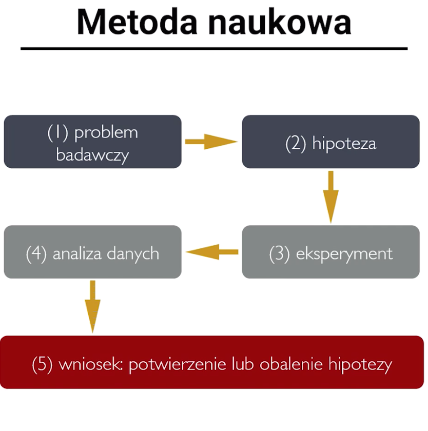
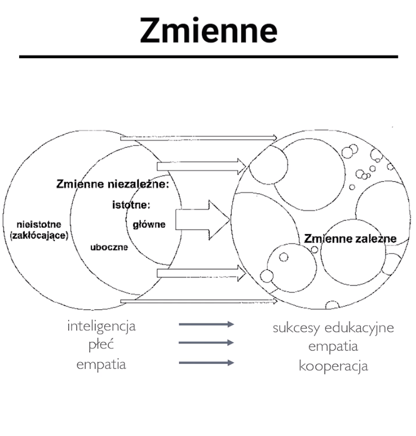
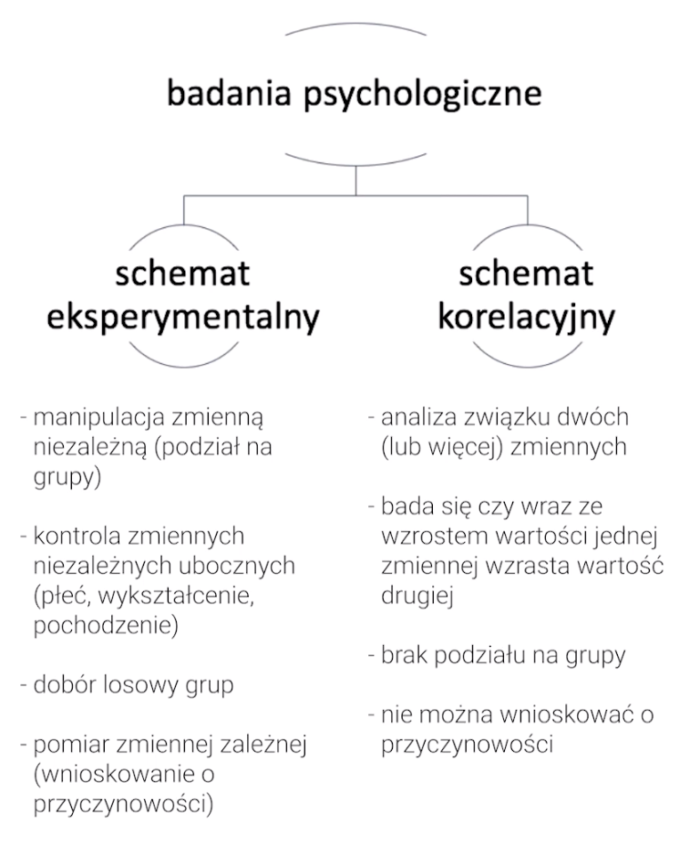
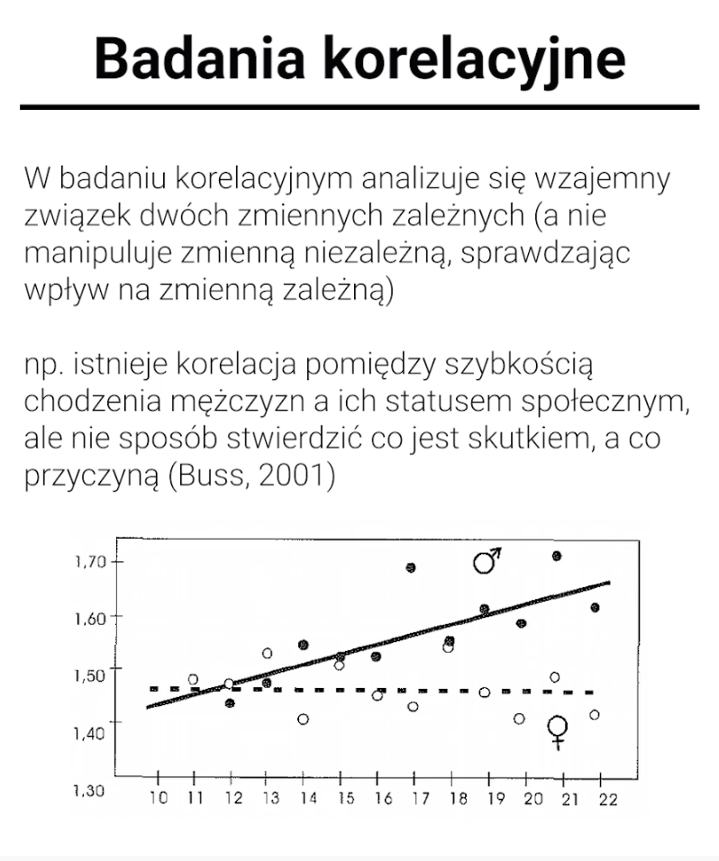

# Metody badawcze psychologii poznawczej

Hipoteza zerowa:  
Słowo „zerowa” można tłumaczyć jako „brak zmiany”. Hipoteza zerowa zazwyczaj jest standardowym założeniem i definiuje się ją jako przewidywanie, że pomiędzy zmiennymi nie będzie interakcji.

Na przykład hipoteza zerowa stwierdza, że nie istnieje związek przyczynowo-skutkowy pomiędzy nową terapią a zmniejszeniem objawów chorobowych. Innymi słowy, oznacza to, że nowa terapia nie zapewnia poprawy w stosunku do standardowej terapii — oraz że zaobserwowana poprawa jest efektem przypadku.

Takie stwierdzenie można przetestować poprzez badania naukowe, takie jak badania kliniczne i zastosowanie odpowiednich testów statystycznych. Jeśli w toku badań klinicznych zostanie dowiedzione, że w rzeczywistości istnieje zależność i nowa terapia przynosi poprawę, hipoteza zerowa jest _obalona_ i można ją odrzucić. W takim przypadku można przyjąć hipotezę alternatywną/badawczą — w tym przykładzie oznacza to, że nowa kuracja jest lepsza niż standardowa.

Zmienna teoretyczna w psychologii, to np. inteligencja, empatia, poziom kontroli poznawczej. Tego się nie da zmierzyć. Wydaje nam się, że za zachowaniami stoją jakieś czynniki, stąd je postulujemy. Ale tak naprawdę, może nic z tego nie występuje.

Każdą zmienną teoretyczną należy przetłumaczyć na zmienną obserwowalną. Dokonać decyzji, co jest wskaźnikiem, kryterium mierzalnym.

Proces przechodzenia pomiędzy zmiennymi teoretycznymi a zmiennymi obserwowalnymi to **operacjonalizacja**.

zmienne zależne podlegają pomiarowi podczas eksperymentu

Inteligencja będzie zmienną niezależną. Zmienną zależną będą sukcesy edukacyjne. Pytamy bowiem, czy sukcesy edukacyjne zalezą od inteligencji.

Pytanie: czy płeć wpływa na poziom empatii -&gt; w takiej sytuacji płeć będzie zmienną niezależną.   
Ale jest tak nie zawsze.  
Czy jakaś cecha psychologiczna wpływa na jakąś inną cechę psychologiczną?  
W tak postawionym pytaniu empatia staje się zmienną niezależną, a zmienną zależną jest kooperacja.

W eksperymencie chodzi o to, żeby wydestylować to co nas interesuje, od tego co tworzy jedynie artefakt.

