# Obliczeniowe modele umysłu

Maszyna Turinga - maszyna stanów dyskretnych

Program komputerowy może wyprwoadzać predykcje, które później będą weryfikowane w działaniach z ludźmi.

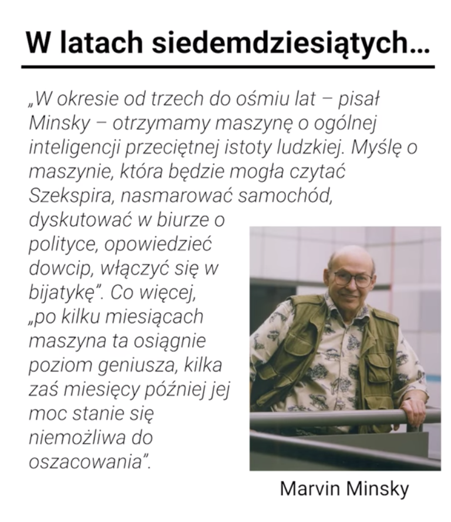

Problem Hilberta - czy ten problem matematyczny jest prawdziwym problemem?

Problem STOPu u Turinga - czy jesteśmy w stanie przewidzieć, że algorytm znajdzie stan STOPu. 

Algorytmy heurystyczne pozwalają przekroczyć zasadę Hilberta.

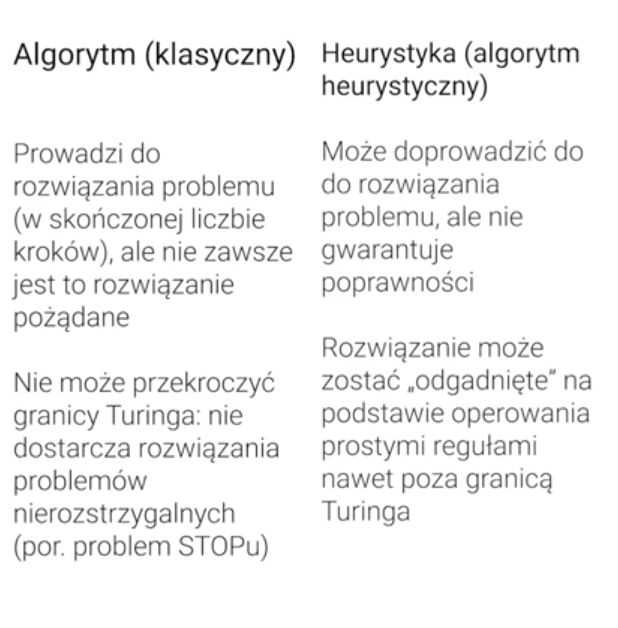

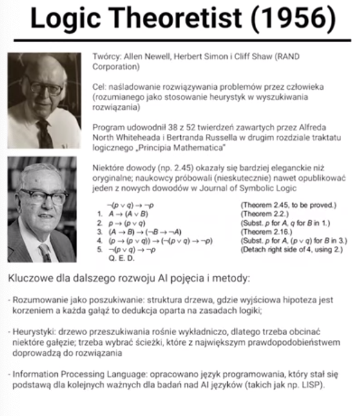

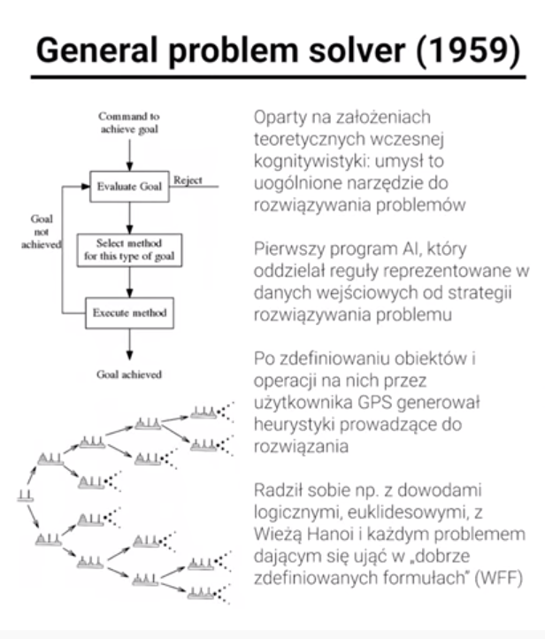

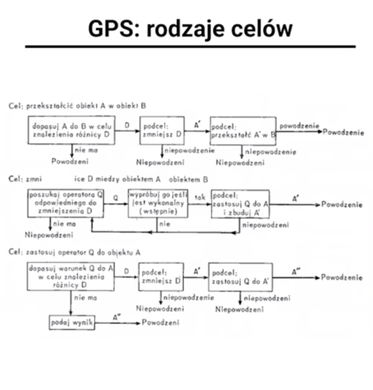

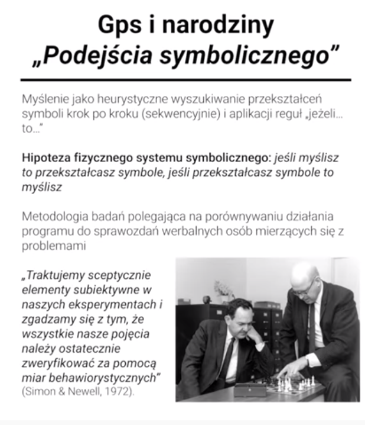

### Sieci semantyczne i architektury poznawcze

Działają w kontekście prymowania - prymowanie uaktywnia daną sieć semantyczną

Wiedza że i wiedza jak  

Uczenie się w ACT - siła węzła, częściej wykorzystywana, staje się łatwiej uchwytna

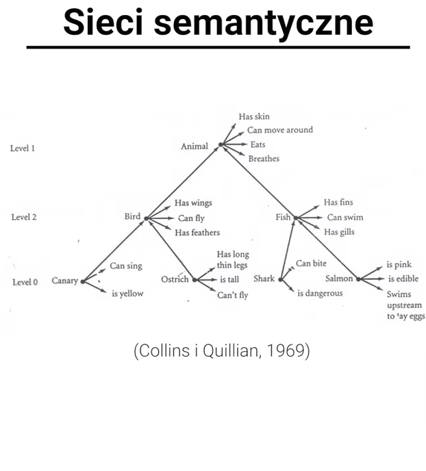

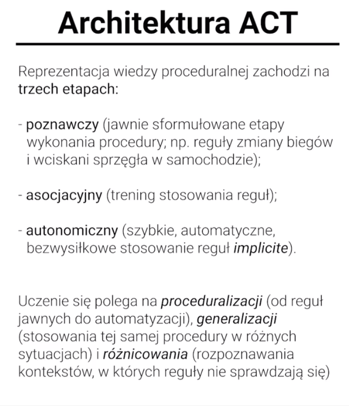

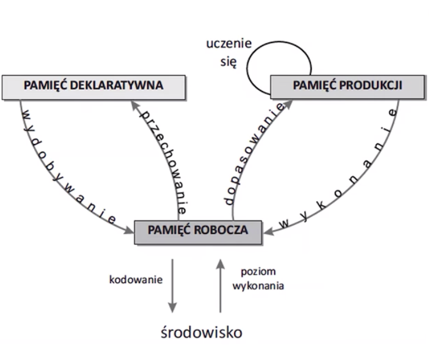

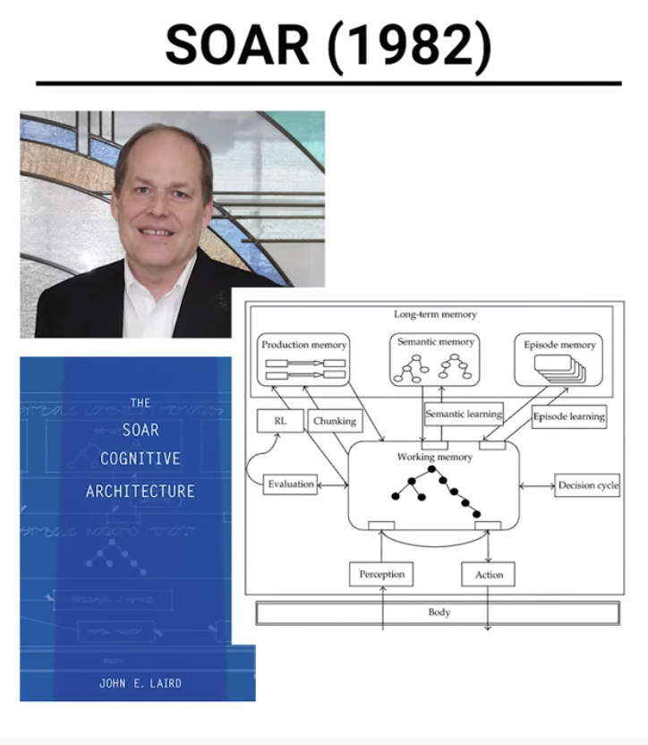

^ wszystko to do tej pory to podejście symboliczne, lecimy dalej

### Koneksjonizm

neurony jako bramki logiczne

sieci wielowarstowowe - sieci ukryte;  

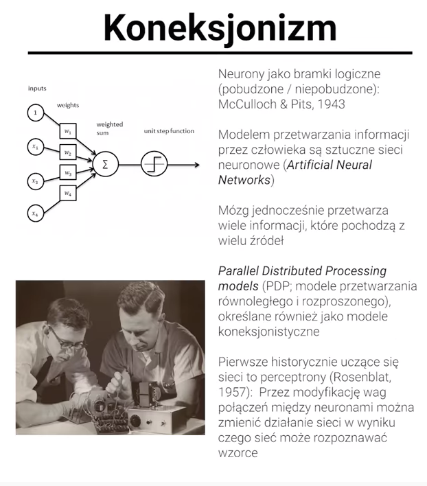

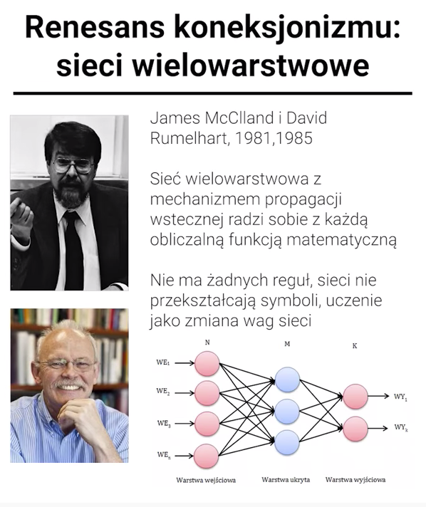

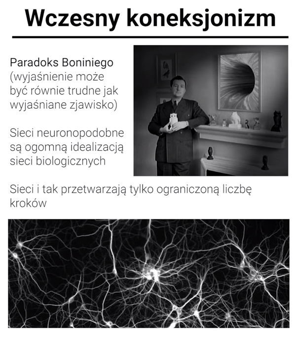

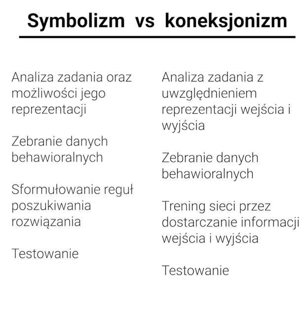

### Modelowanie

Blue Brain Project - z punkty widzenia Psychologii poznawczej, mało istotne, bo raczej działanie niż zajmowanie się zachowaniem

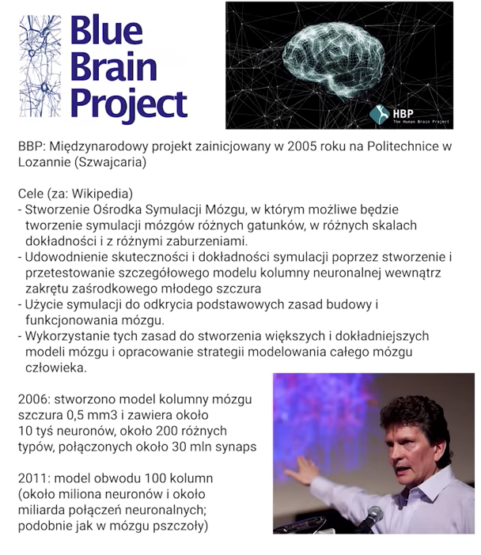

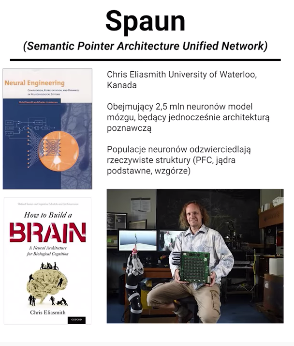

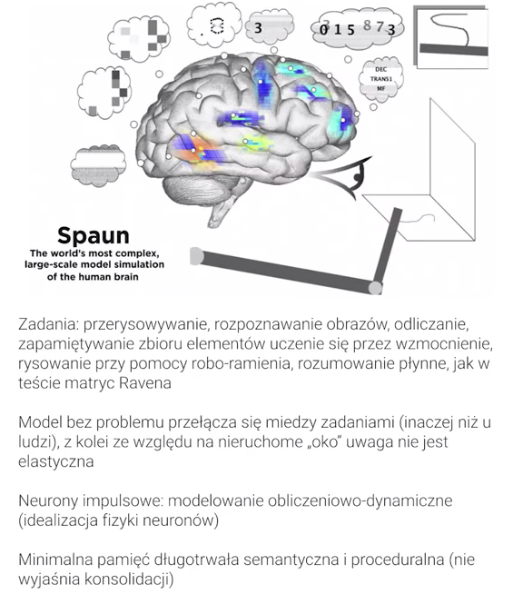

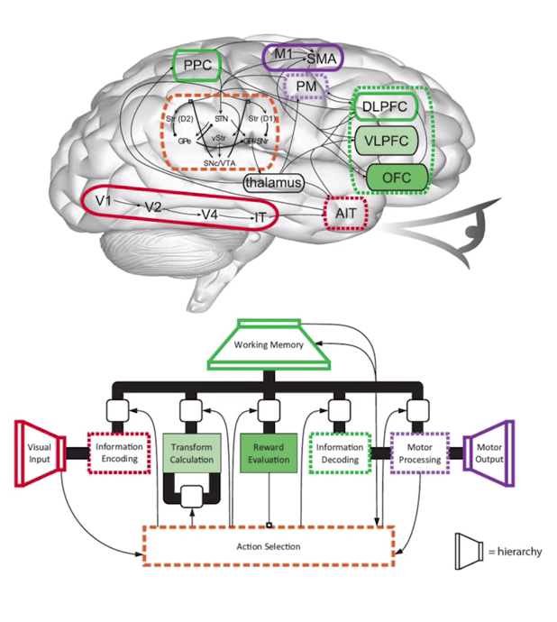

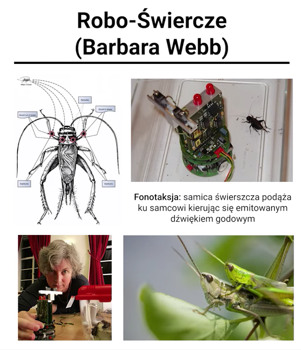

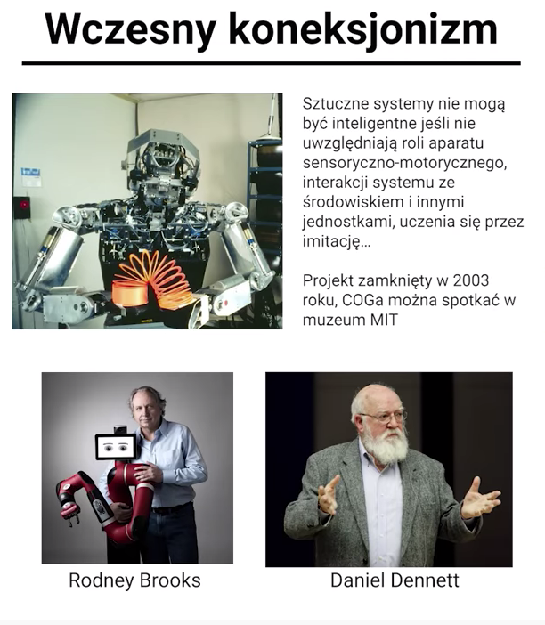

W wykładzie mowa była o obliczeniowych modelach umysłu oraz sztucznych architekturach poznawczych. Rozpoczęliśmy od omówienia początków informatyki i genezie pojęcia "algorytm". W związku z tym omówiliśmy krótko działanie maszyny Turinga oraz wspomnieliśmy o podziale na silną i słabą sztuczną inteligenzję \(silna: mózg/umysł jest komputrem; słaba: mózg/umysł może być symulowany obliczeniowo\). Przyjrzeliśmy się następjnie pierwszym programom sztucznej inteligencji, takim jak Teoretyk Logiczny oraz Uogólniony Rozwiązywacz Problemów, które to opracowane zostały w tzw. podejściu symbolicznym. To podejście, zapoczątkowane przez Newella i Simona, zakłada, że myślenie polega na heurystycznym wyszukiwaniu przekształceń symboli krok po kroku oraz aplikacji reguł „jeżeli… to…”. Wiąże się z tym tzw. hipoteza fizycznego systemu symbolicznego, zgodnie z którą każdy fizyczny system, który przekształca symbole możemy nazwać systemem myślącym. Następnie przyjrzeliśmy się kolejnym - historycznie - architekturą poznawczym, takim jak ACT Andersona oraz SOAR Lairda, które modelują zarówno wiedzę deklaratywną, jak i proceduralną. W kolejnej części zajęliśmy się koneksjonizmem, będącym inspirowaną działaniem mózgu alternatywą dla podejścia symbolicznego. Omówiliśmy pierwsze sieci neuronopodobne, tzw. perceptrony oraz ich ograniczenia, a także wskazaliśmy, że nowsze sieci, wolne są od wad swych protoplastów. W ostatniej części przyjrzeliśmy się dwóm współczesnym wielkim projektom modelowania: pierwszy to Blue Brain Project, który modeluje działanie pojedynczych neuronów i złożonych struktur mózgowych; drugi zaś to SPAUN, który modeluje nie tylko działanie mózgu, ale również procesów poznawczych. Informacje te uzupełniliśmy również o inne współczesne trendy w modelowaniu, takie jak biorobotyka oraz robotyka kognitywna.

