# Pamięć

Strzałki symbolizują ilość zmysłów - wszystko jest przechowywane w pamięci sensorycznej, ale później już musi zostać jakoś skompresowane, żeby mogło nawiedzić pozostałe rejestry.

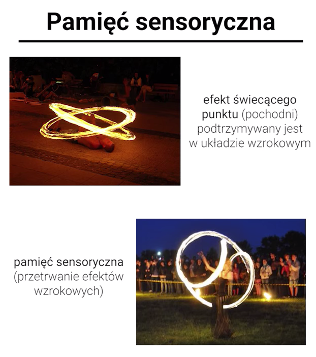

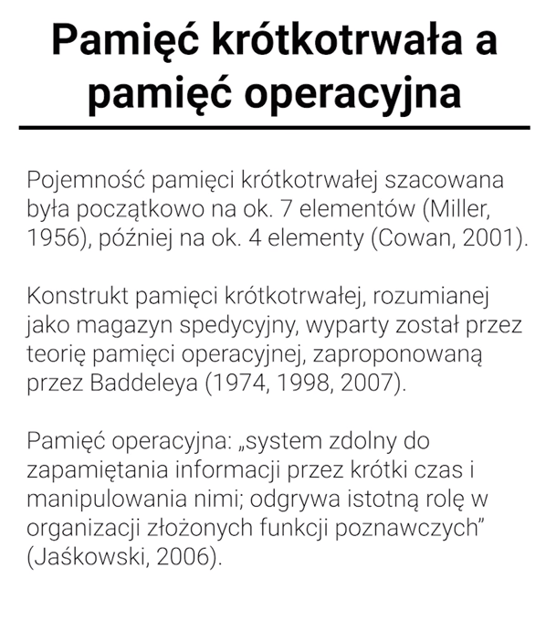

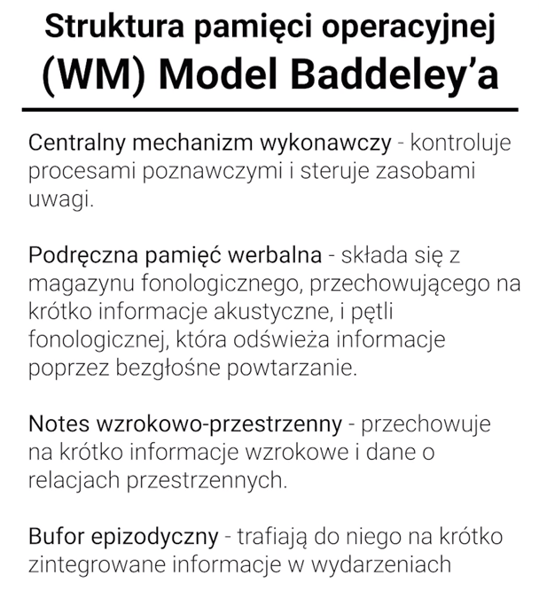

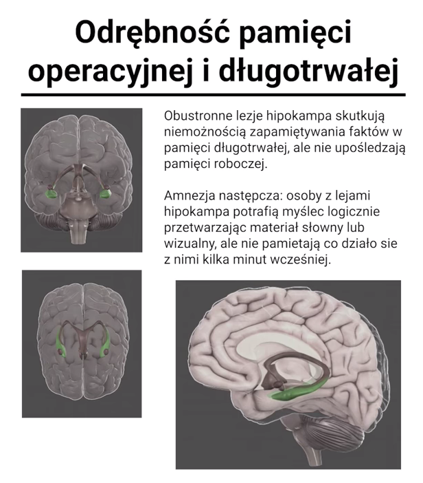

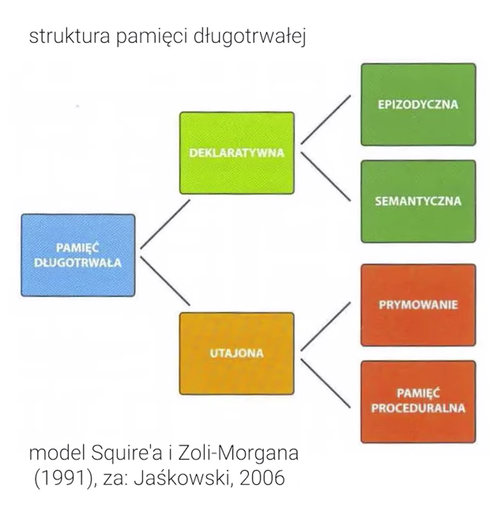

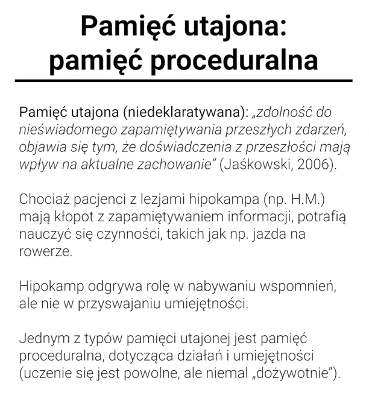

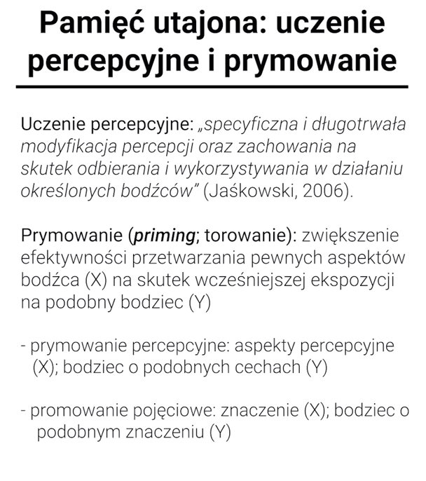

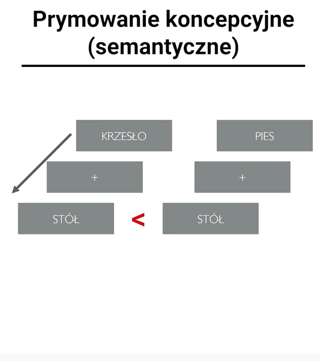

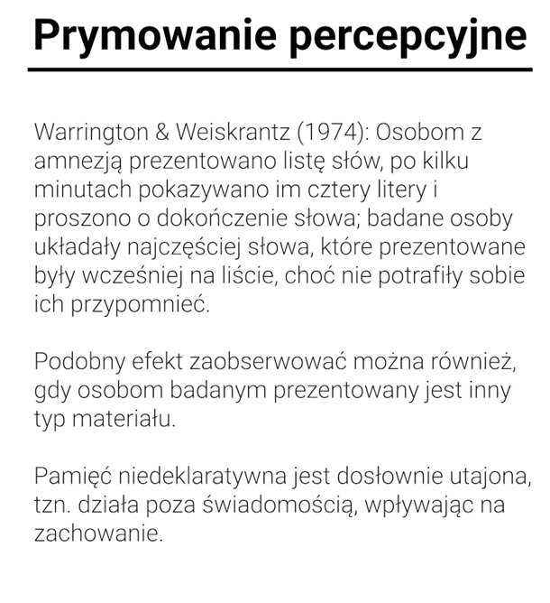

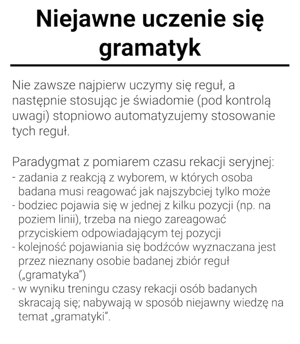

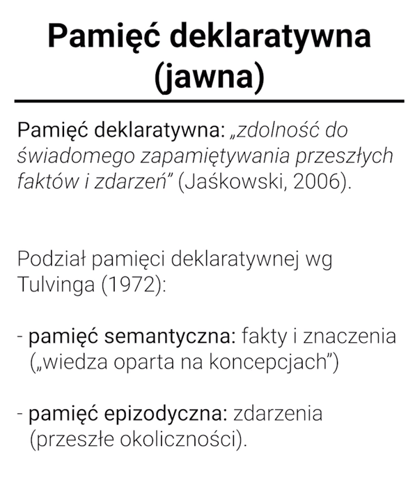

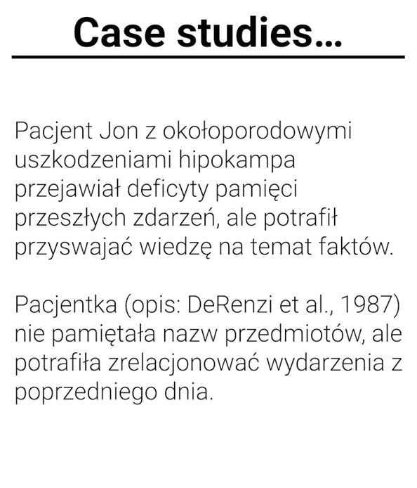

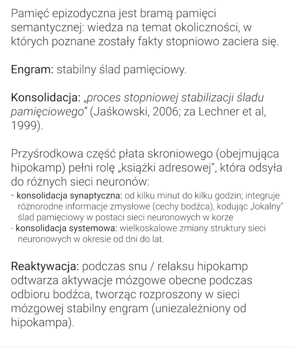

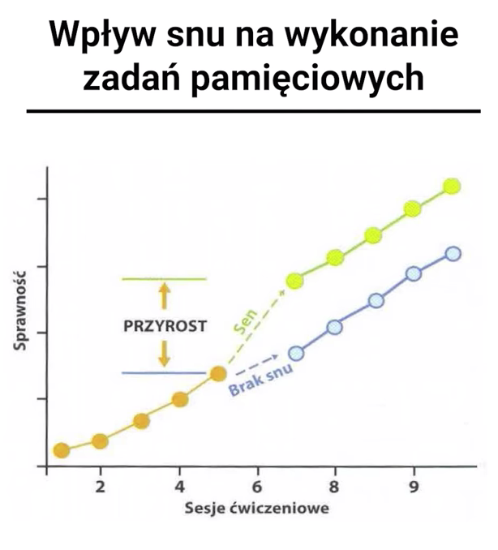

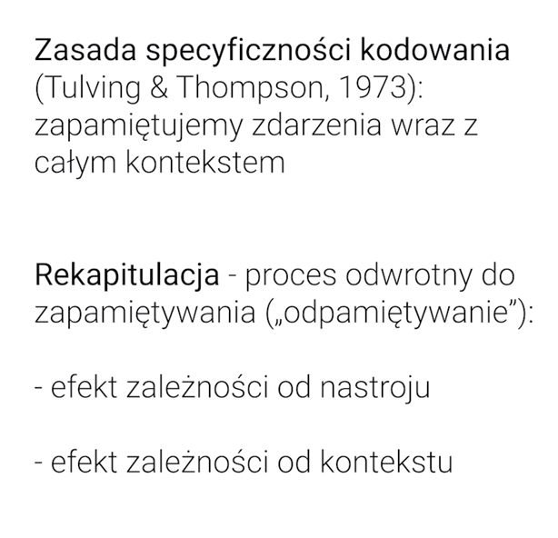

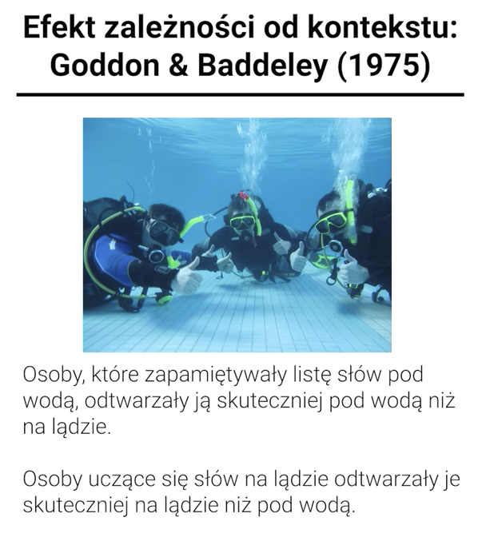

