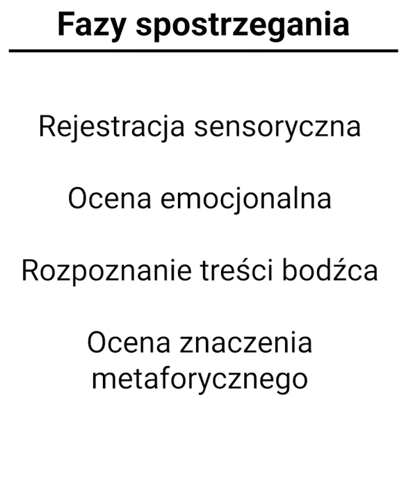

# Percepcja wzrokowa

Struktury wzrokowe:  
V1: krawędzie, obiekty

V4,V5: postrzeganie koloru lub ruchu

### Prawa percepcji

Gestalt: świat do nas nie dociera zatomizowany, tylko w pewnych całościach - my myślimy całościowo o świecie, świat dociera w pewnej postaci

### Cykl percepcyjny

Postrzeganie świata jest równiez jego tworzeniem.

Nasz umysł dobiera srodki percepcyjne żeby odnaleźć się w otoczeniu.

Na powyższym rysunku jest to swietnie pokazane. Gdzie kładą się fiskacje w zależności od tego, jakie mamy nastawienie poznawcze.

Podczas wykładu omówiliśmy wybrane zagadnienia percepcji wzrokowej. Rozpoczęliśmy od czterech faz postrzegania, jakimi są rejestracja sensoryczna, ocena emocjonalna, rozpoznanie treści bodźca oraz ocena znaczenia metaforycznego. Przybliżyliśmy podstawy anatomiczno-funkcjonalne układu wzrokowego, z uwzględnieniem teorii dwóch szlaków wzrokowych \(odpowiedzialnych za świadomy percept oraz działanie\). Następnie omówiliśmy prawa percepcji, badane przez psychologów postaci \(zasada odróżniania figury/tła, zasada podobieństwa, zasada kontynuacji, zasada bliskości, zasada zamykania\) oraz wybrane iluzje wzrokowe. W ostatniej części wykładu zajęliśmy się cyklem percepcyjnym według Ulrica Neissera, którego elementami są informacja docierająca ze środowiska, schemat pamięciowy oraz aktywna eksploracja.

