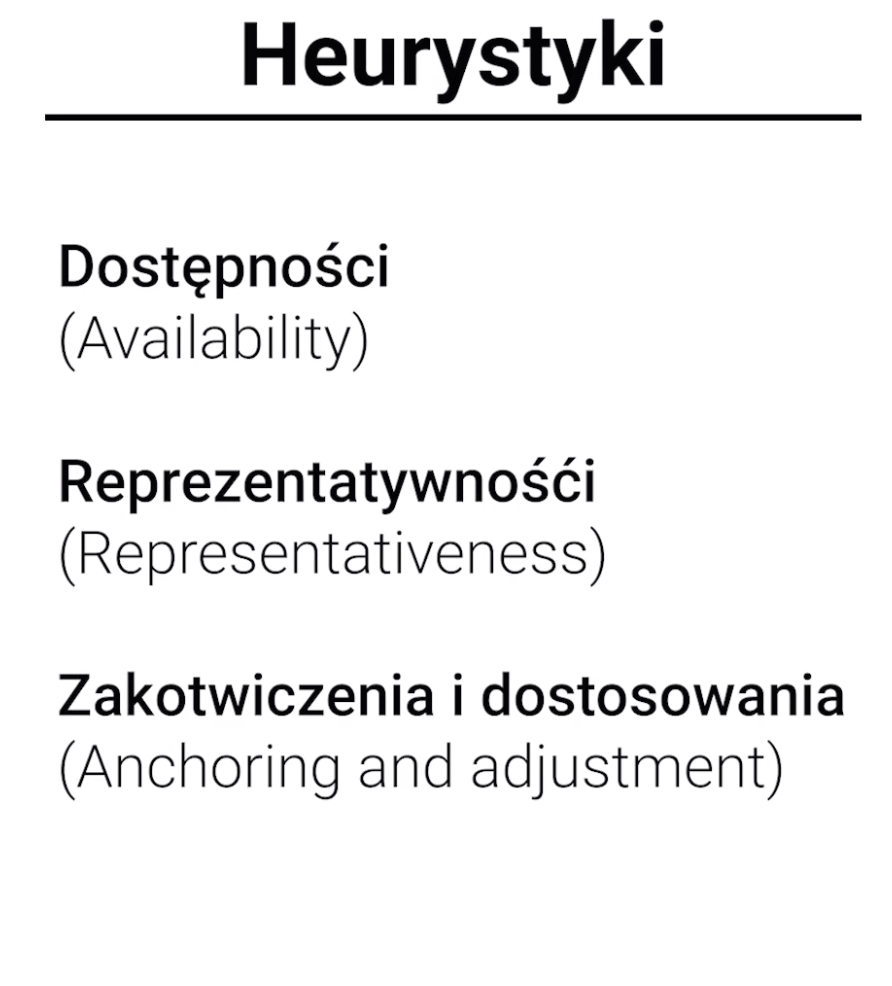

# Podejmowanie decyzji

W niniejszym wykładzie przyglądaliśmy się poznawczym aspektom wydawania sądów i podejmowania decyzji. W pierwszej części przedstawiliśmy klasyczną ekonomiczną koncepcję Homo oeconomicus, która zakłada, że człowiek jest racjonalny w sensie instrumentalnym \(tj. dąży do maksymalizacji użyteczności, wybiera odpowiednie środki do realizacji swoich celów; kieruje się regułą prawdopodobieństwa, wybiera bardziej prawdopodobne opcje\), zaś cele, które sobie stawia są egoistyczne \(nastawione na pomnożenie własnych dóbr\). Następnie przedstawiliśmy badania, które poddają w wątpliwość pełną racjonalność człowieka, wskając jednocześnie, że popełniane przez ludzi błędy są schematyczne i wynikają z kierowania się tzw. heurystykami, czyli uproszczonymi regułami rozumowania. W kolejnej części wykładu odwołując się do koncepcji Kahnemana i Tversky'ego omówiliśmy trzy takie heurystyki: dostępności, reprezentatywności oraz zakotwiczenia/dostosowania. Pierwsza z tych heurystyk sprawia, że wydając sądy i podejmując decyzje kierujemy się danymi które są są najłatwiej dostępne \(zaniedbując inne przydatne dane\); druga, że wydajemy sądy i podejmujemy decyzje w oparciu o to czy dany obiekt/zdarzenie jest z naszego punktu widzenia charakterystycznym przedstawicielem szerszego zbioru obiektów/zdarzeń; zaś trzecia, że nasze sądy i decyzje uzależnione są od "zakotwiczenia" na pewnych danych. Efektem działania heurystyki dostępności jest np. przeszacowywanie zagrożenia katastrofami lotniczymi \(dane na temat takich katastroch są łatiwej dostępne\); heurystyki reprezentatywności - błąd hazardzisty; zaś heurystyki zakotwiczenia/dostosowania - efekt ignorowania proporcji podstawowej. Po przyjrzeniu się heurystykom zbadaliśmy tzw. efekt obramowania, który wbrew prawidłom klasycznej ekonomii, przejawia się w tym, że nasze sądy i decyzje uzależnione są od sposobu sformułowania problemu decyzyjnego. W ostatniej częsci wykładu zastanawialiśmy się czy ludzie są "rzeczywiście" tak nieracjonalni, jak wskazują na to wyniki eksperymentów Kahnemana i Tversky'ego. Po przyglądnięciu się obiekcjom Gerda Giegerentzera wobec tej tezy \(np. w rozumowaniach statystycznych, których wymagają eksperymenty Kahnemana i Tversky'ego popełniamy błędy, gdyż na co dzień nie mamy do czynienia z matematycznym rachunkiem prawdopodobieństwa\) zwróciliśmy się ku koncepcji rozdzielającej "racjonalność teoretyczną" od "racjonalności praktycznej". Podział ten zilustrowaliśmy dwoma wariantami zadania selekcyjnego Wasona.

