# Pojęcia

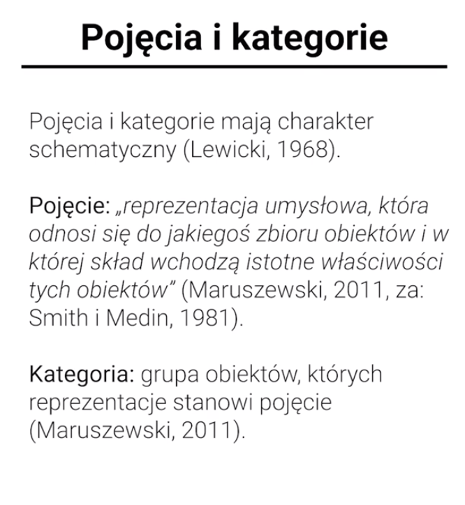

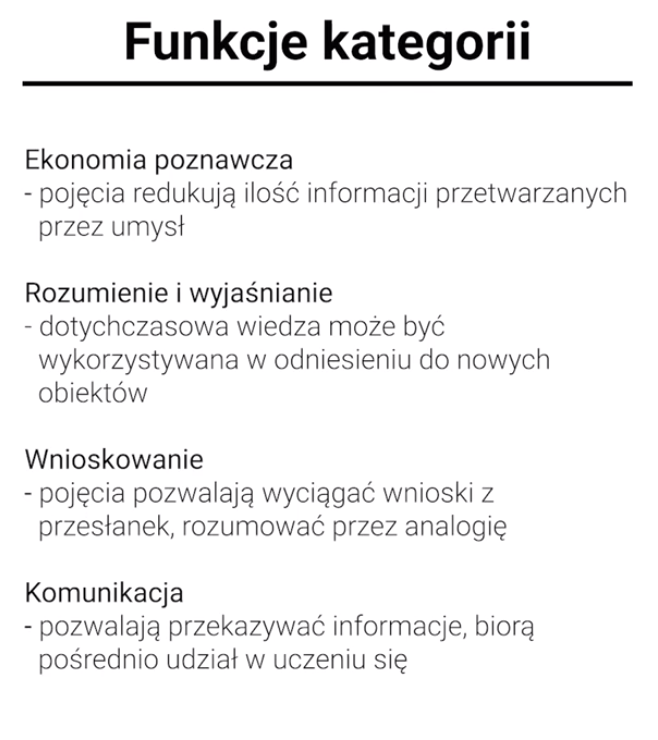

### Podobieństwo

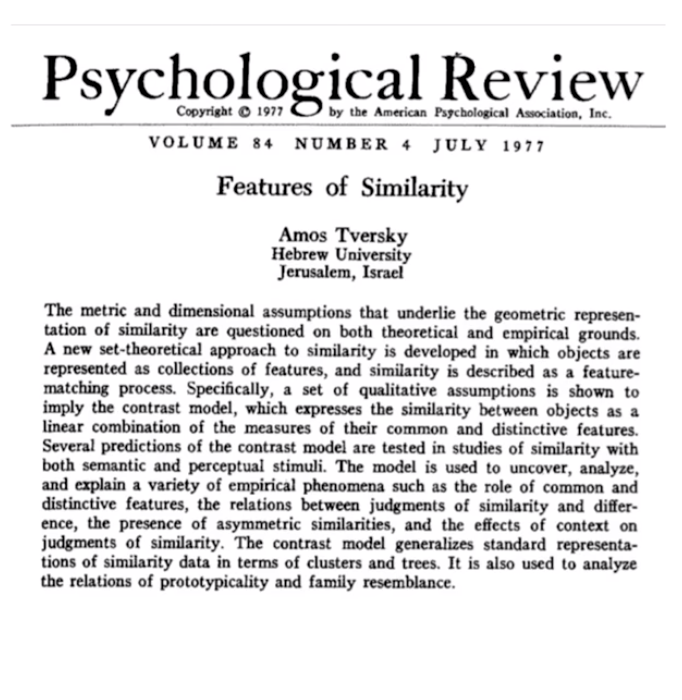

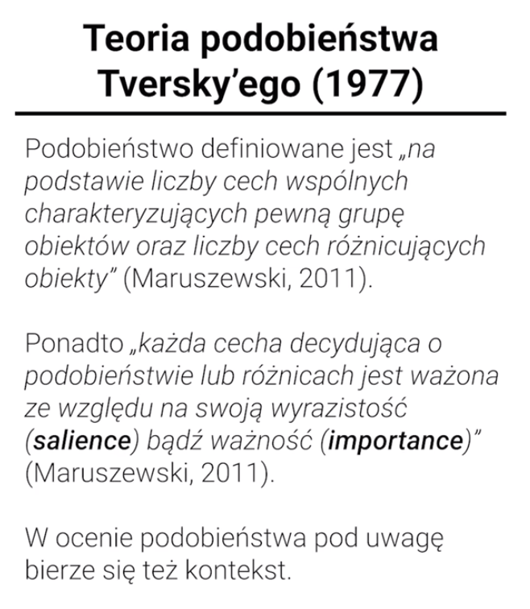

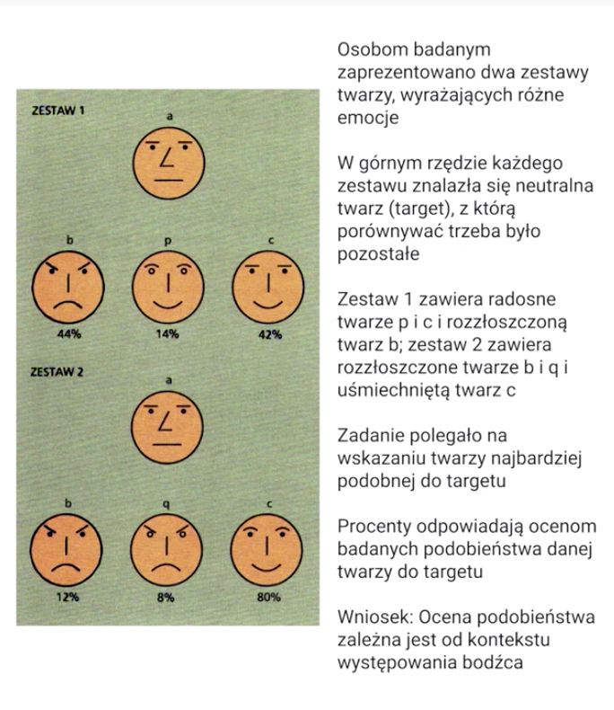

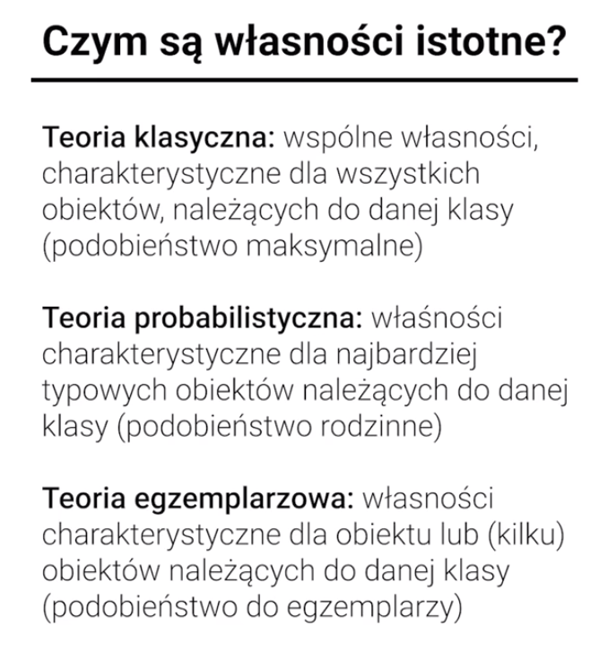

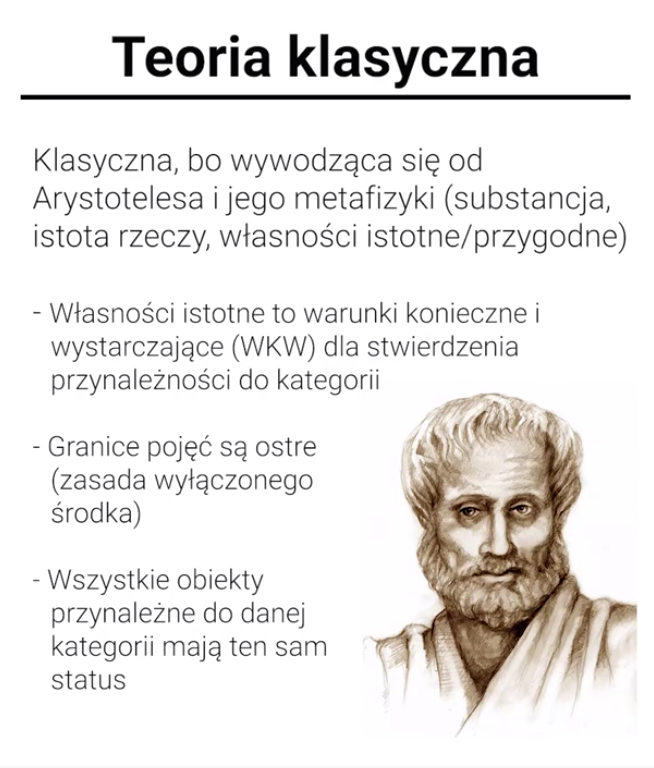

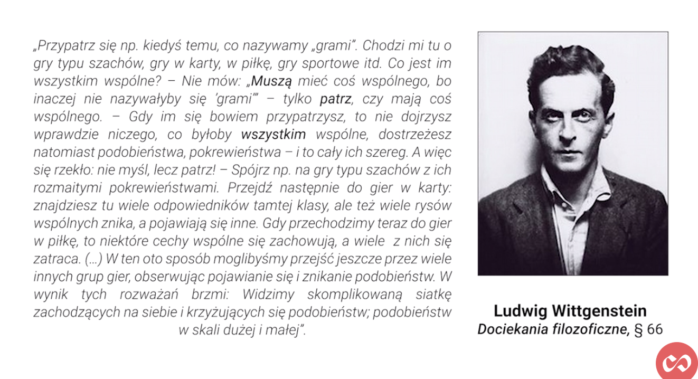

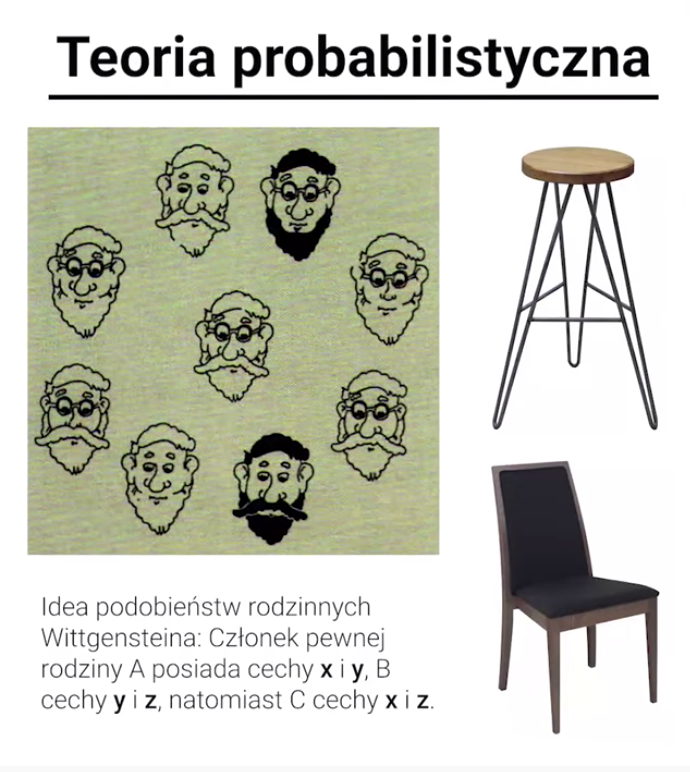

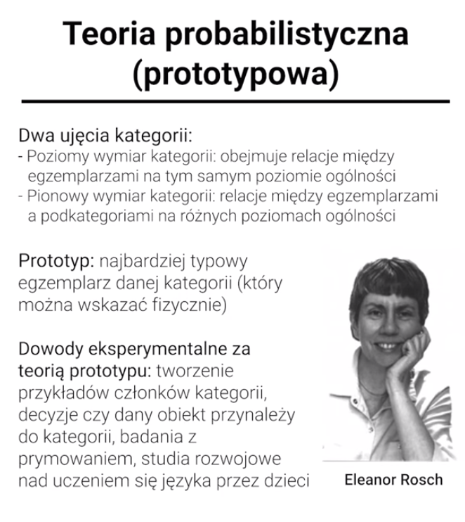

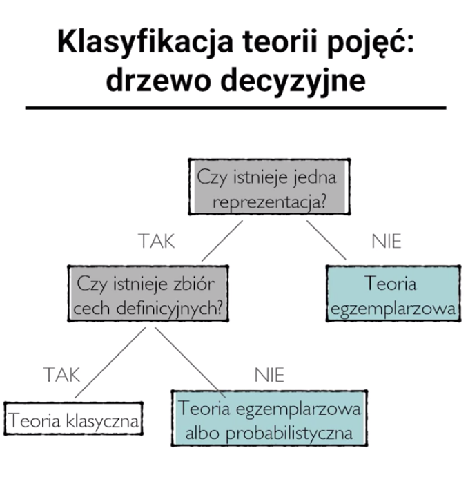

### Teoria symboli percepcyjnych

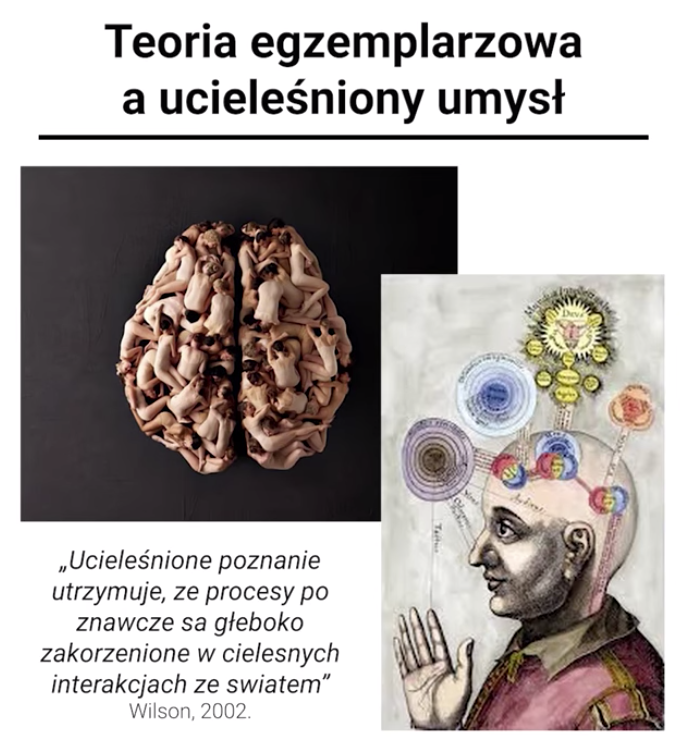

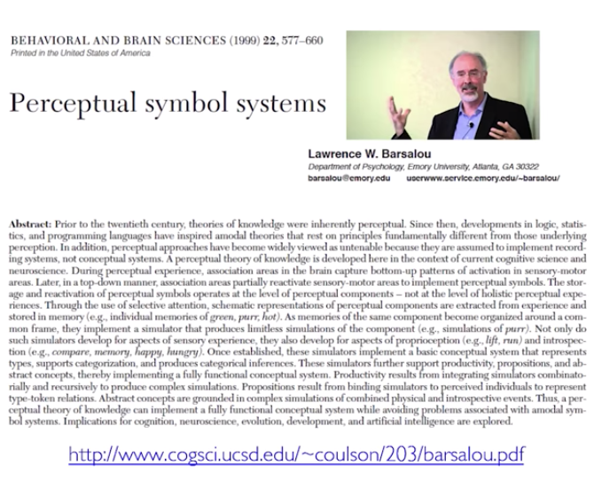

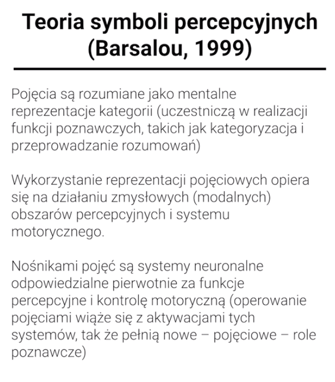

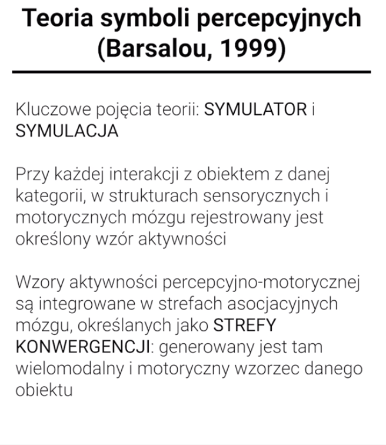

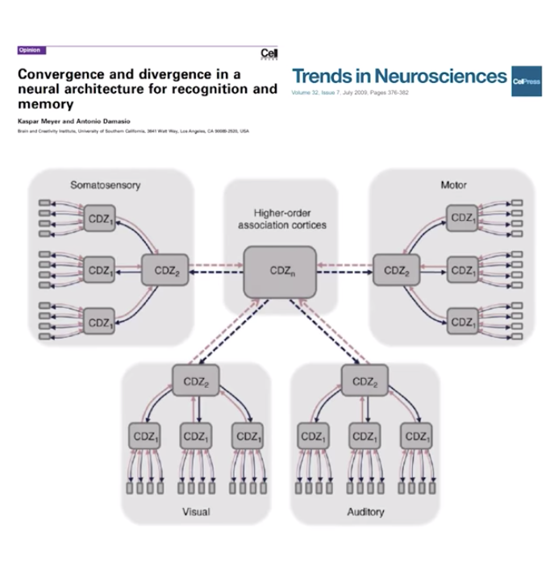

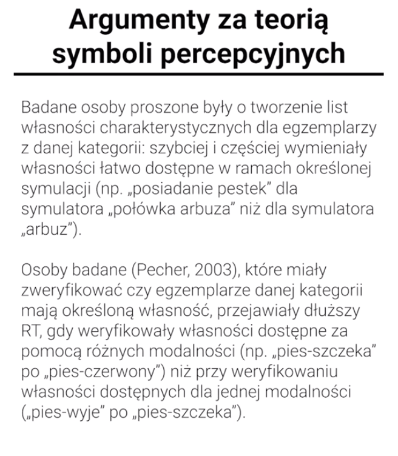

W trakcie niniejszego wykładu zajmowaliśmy się zagadnieniami przetwarzania pojęć i kategorii. Na początku stwierdziliśmy, że pojęcie „reprezentacja umysłowa, która odnosi się do jakiegoś zbioru obiektów i w której skład wchodzą istotne właściwości tych obiektów” \(Maruszewski, 2011, za: Smith i Medin, 1981\), zaś kategoria to grupa obiektów, których reprezentację stanowi pojęcie \(Maruszewski, 2011\). Operowanie przez nasz umysł takimi schematycznymi reprezentacjami sprzyja m.in. ekonomii poznawczej \(pojęcia redukują ilość informacji przetwarzanych przez umysł\), rozumowaniu i wyjaśnianiu \(dotychczasowa wiedza może być wykorzystywana w odniesieniu do nowych obiektów; pojęcia pozwalają wyciągać wnioski z przesłanek, rozumować przez analogię\) oraz komunikacji \(pozwalają przekazywać informacji\) i uczeniu się. Zauważyliśmy, że zagadnienie przetwarzania pojęć wiąże się z problemem podobieństwa, przy czym podobieństwo definiowane jest „na podstawie liczby cech wspólnych charakteryzujących pewną grupę obiektów oraz liczby cech różnicujących obiekty” \(Maruszewski, 2011\), ponadto „każda cecha decydująca o podobieństwie lub różnicach jest ważona ze względu na swoją wyrazistość \(salience\) bądź ważność \(importance\)” \(Maruszewski, 2011\); w ocenie podobieństwa pod uwagę bierze się też kontekst. Omówiliśmy kluczowe psychologiczne teorie pojęć, które rozróżnić można na podstawie ujmowania w nich czym są tzw. własności istotne. W teorii klasycznej są to wspólne własności, charakterystyczne dla wszystkich obiektów, należących do danej klasy \(podobieństwo maksymalne\), w teorii probablistycznej są to właśności charakterystyczne dla najbardziej typowych obiektów należących do danej klasy \(podobieństwo rodzinne\), zaś w teorii egzemplarzowej własności charakterystyczne dla obiektu lub \(kilku\) obiektów należących do danej klasy \(podobieństwo do egzemplarzy\). Następnie przyjrzeliśmy się dokładniej tym trzem teoriom. Teoria klasyczna \(nazwa odnosi się do tego, że sięga ona aż do filozofii starożytnej, głównie do Arystotelesa\) mówi, że o przynależnośći obiektu do kategorii decyduje to czy spełnia on warunki konieczne i wystarczające \(WKW\). Oznacza to, że granice pojęć są ostre, a obiekty przynależne do danej kategorii mają ten sam status. Pokazaliśmy, że o ile teoria ta radzi sobie dobrze z pojęcami matematycznymi, zawodzi jeśli chodzi o wiele pojęć potocznych. W związku z tym wprowadziliśmy teorię probabilistyczną \(prototypową\) wprowadzoną przez psycholożke Eleanor Rosch, a inspirowaną filozoficznymi wywodami Ludwiga Wittgensteina. Podstawowym pojęciem teorii Rosch jest "prototyp", czyli najbardziej typowy egzemplarz danej kategorii \(który można wskazać fizycznie\). Decydując o tym czy dany obiekt przynależy do danej kategorii \(podpadając pod pojęcie\) nie badamy WKW, ale bliskość do prototypowego obiektu. Choć teoria Rosch zyskała dobre podstawy empiryczne, okazało się, że prototypy są zmienne kulturowo, a nawet - jak twierdzi Lawrance Barsalou - osobniczo i sytuacyjnie \(prototypy ad hoc\). Zdaniem tego ostatniego badacza nasze zdolności pojęciowe lepiej tłumaczy tzw. teoria egzemplarzowa. Mówi ona, że pojęcie jest reprezentacją jednego lub kilku egzemplarzy \(a nie sumaryczną reprezentacją zbioru\), co oznacza, że umysł nie tworzy abstrakcyjnej reprezentacji, tylko przechowuje w pamięci informacje na temat poszczególnych egzemplarzy. Barsalou nie poprzestaje na tej ogólnej tezie, ale pokazuje szczegółowy mechanizm jak to się dzieje. Mechanizm ten opisuje jego teoria symboli percepcyjnych \(percepcyjno-motorycznych\), której poświęciliśmy ostatnią część wykładu. Mówi ona, że nośnikami pojęć są systemy neuronalne odpowiedzialne pierwotnie za funkcje percepcyjne i kontrolę motoryczną \(operowanie pojęciami wiąże się z aktywacjami tych systemów, tak że pełnią nowe – pojęciowe – role poznawcze\). Przetwarzanie pojęć odbywa się natomiast na drodze symulacji mentalnych, czyli reaktywacji struktur percepcyjno-motorycznych podobnych do aktywacji mózgowych, które zachodzą podczas rzeczywistego kontaktu z obiektami z danej kategorii. Powiedzieliśmy, że choć przewidywania teorii probabilitycznej \(prototypowej\) i egzemplarzowej bywają podobne, na korzyść tej ostatniej świadczy dokładny opis, jak pojęcia prztwarzane są przez mózg.

