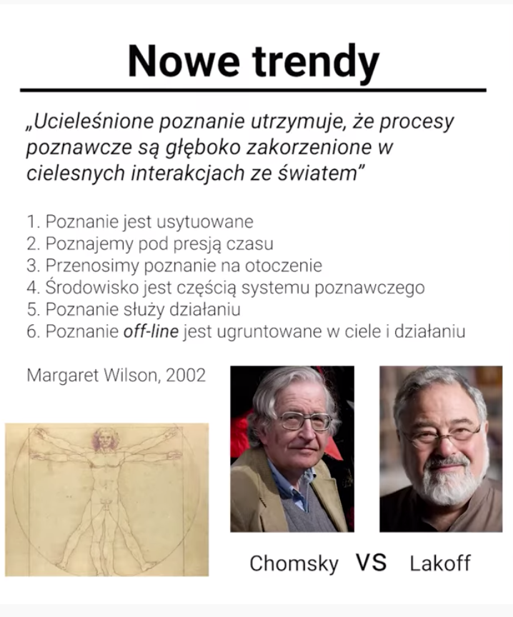

# Psychologia poznawcza - intro

Miller: 7 +/-2 ale dzisiaj to raczej 4 +/- 1 -&gt; przy czym to zależy od elementów poznawczych i to jest coś, co możesz zaatakować w kontekście interfejsu

Jakbyś chciał napisać tutaj swój podręcznik, to musisz zrobić badania.

Teoria ucieleśnionego poznania: kiedy myślimy off-lineowo, aktywujemy te same obszary w mózgu, które odpowiedzialne są za pokonywanie drogi on-line

