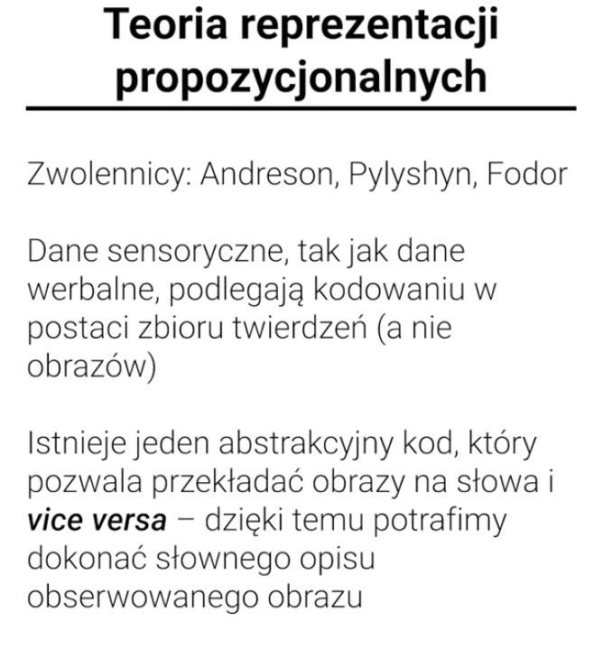

# Reprezentacje umysłowe

To jedno z podstawowych pojęć psychologii poznawczej.

Psychologia poznawcza nie zajmuje się światem, tylko jak świat jest przetwarzany.

### Obrazy umysłowe

### Czy rzeczywiście coś takiego jak obrazy umysłowe istnieje?

### Teoria podwójnego kodowania

### Psychologia ekologiczna

W nieniejszym wykładzie zajmowaliśmy się reprezentacjami umysłowymi, czyli \(zgodnie z definicją Nęcki, Orzechowskiego i Szymury\) "umysłowymi odpowiednikami obiektów – realnie istniejących, jak też fikcyjnych lub hipotetycznych". W części pierwszej przyjrzeliśmy się podstawowym pojęciom, takim jak "obraz umysłowy" czy "wyobraźnia", a także sporowi realistów z kontruktywistami \(pierwsi sądzą, że treści umysłu dokładnie "odbijają" rzeczywistość, zaś drudzy, że te same obiekty mogą być reprezentowane różnie w zależności od czynników, takich jak wiedza czy czynniki emocjonalne\). W części drugiej omówiśmy teorię reprezentacji obrazowych Kosslyna, a także wspierające ją dane eksperymentalne. W tym celu przybliżyliśmy klasyczne paradygmaty eksperymentalne, takie jak rotacje mentalne oraz skaning mentalny. Część trzecią rozpoczęliśmy od przybliżenia krytyki teorii reprezentacji obrazowych, a następnie omówiliśmy teorię reprezentacji propozycjonalnych, ucieleśnioną w sformułowanej przez Fodora hipotezie języka myśli, oraz wspieraną przez klasyczne badania Clarka. W ostatniej części omówiliśmy konsyliacyjną \(wobec zwolenników reprezentacji obrazowych i propozycjonalnych\) teorię podwójnego kodowania sformułowaną przez Paivio. Zgodnie z nią, jednostkami poznawczego przetwarzania wiedzy są imageny i logogeny, które mogą być na siebe przekodowywane. Wykład zakończyliśmy krótkim wspomnieniem o psychologii ekologicznej i antyreprezentacjoniźmie Gibsona. W tym celu wprowadziliśmy m.in. pojęcie afordancji, czyli "aktów lub zachowań, których wykonanie umożliwiają nam pewne obiekty, miejsca lub zdarzenia".

