# Świadomość

Stan minimalnej świadomości  
Kiedy świadomość != przytomność

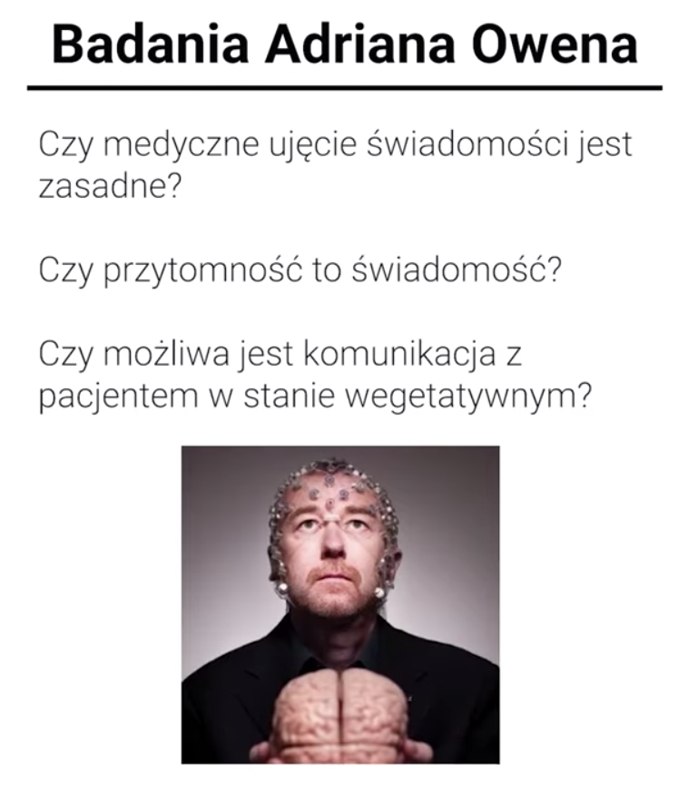

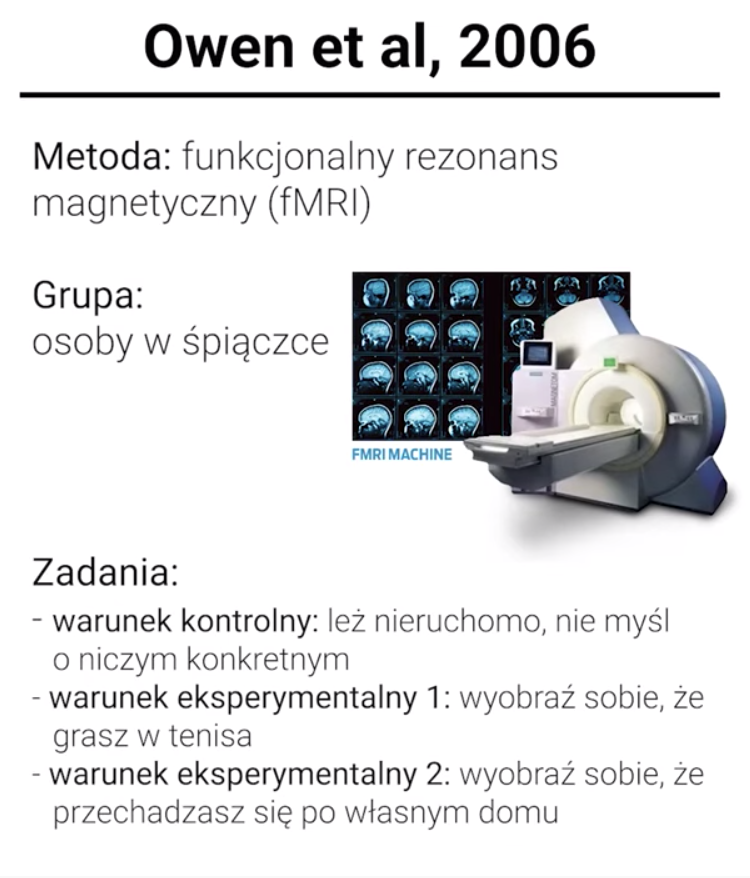

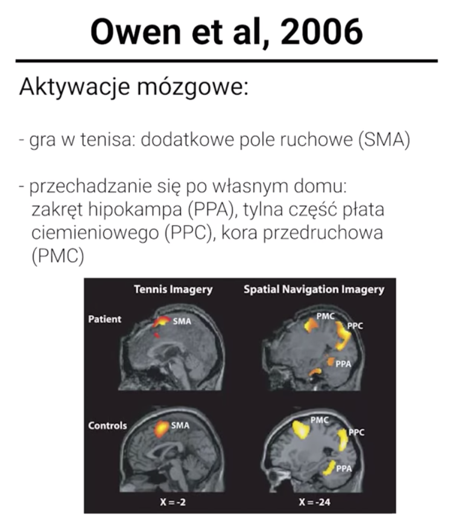

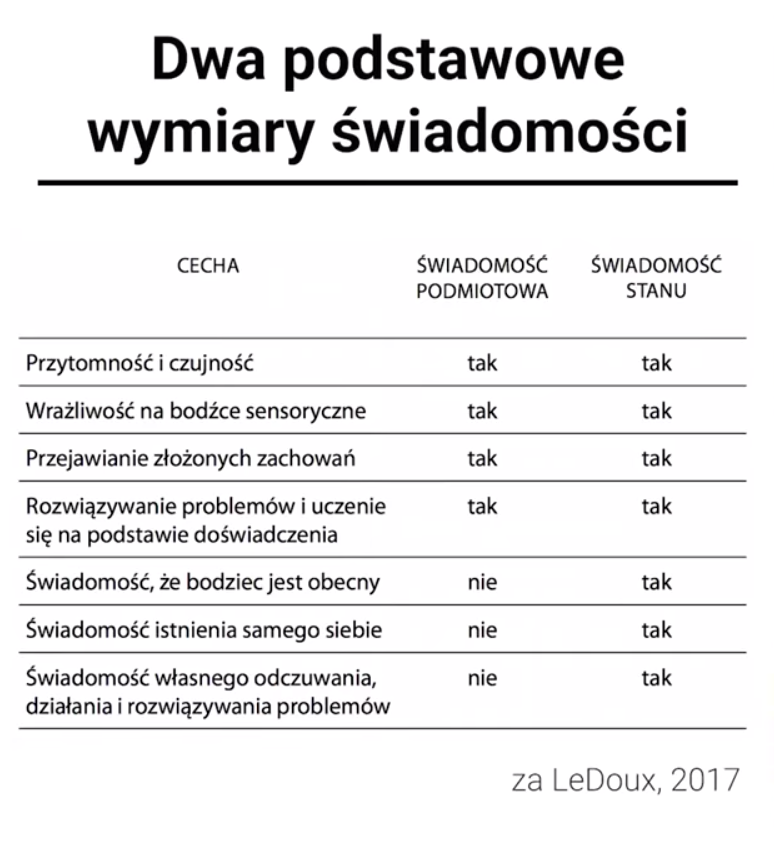

Inteligentne działanie -&gt; działanie celowe

I lecimy dalej:  
intuicje za: Edmund Rolls i Andy Clark - to język, syntaksa, umożliwia nam projektowanie, wybieganie w przyszłość, analizowanie, budowanie historii, których \(jeszcze\) nie ma.  
Zbudujmy wtedy nowy język narracji, nową syntaksę - twierdzenie Shapiro Whorfa 100% -&gt; Arrival

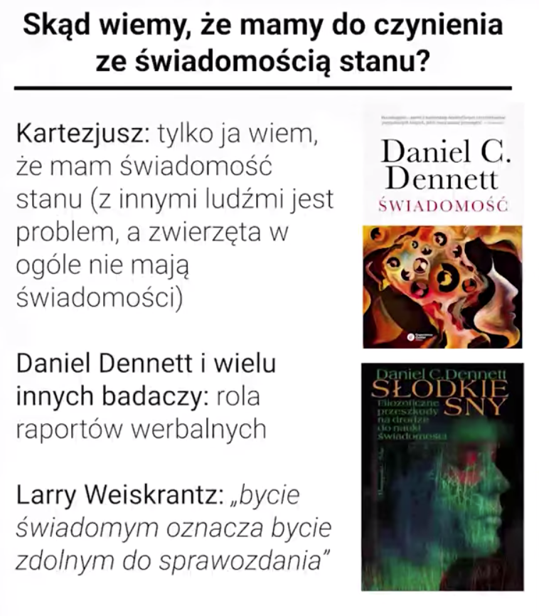

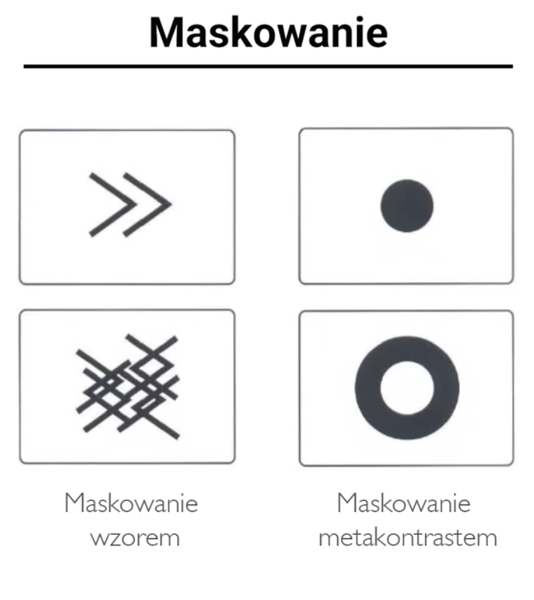

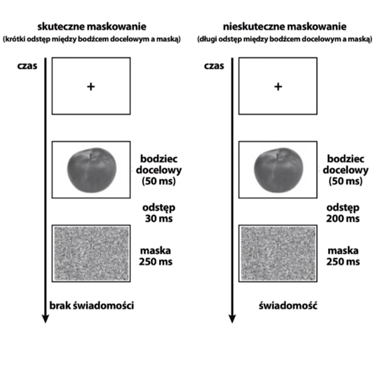

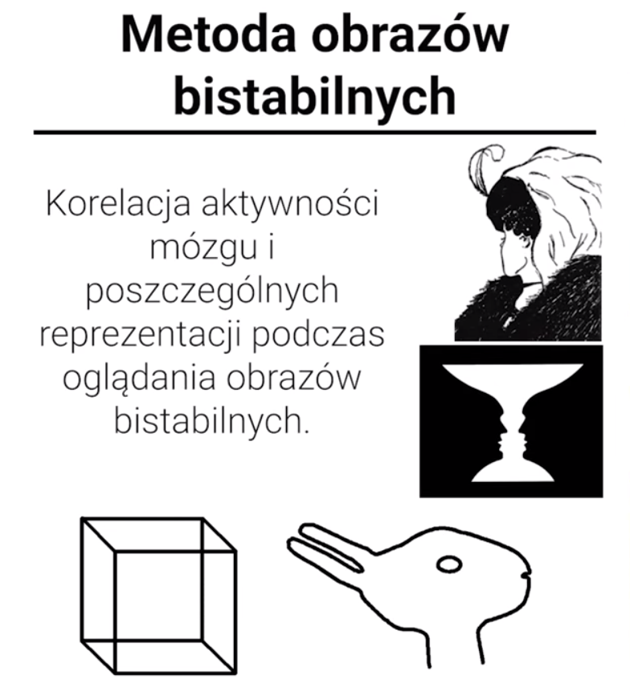

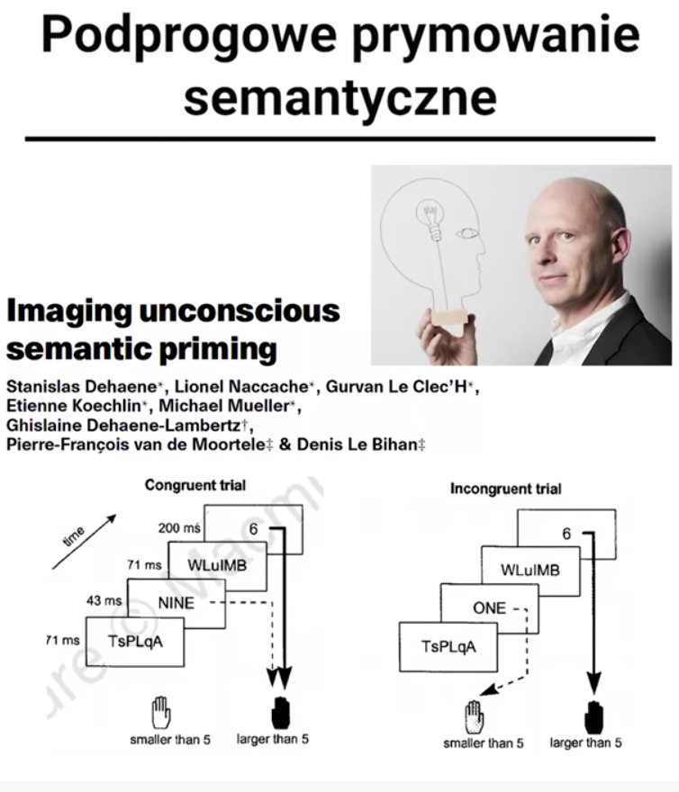

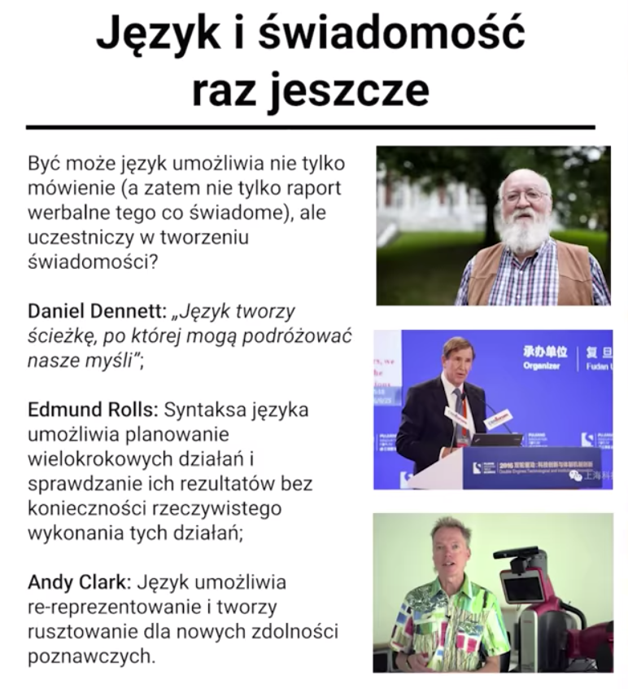

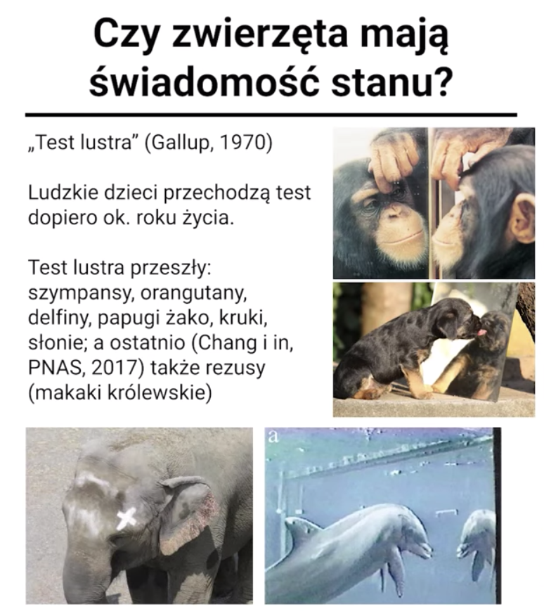

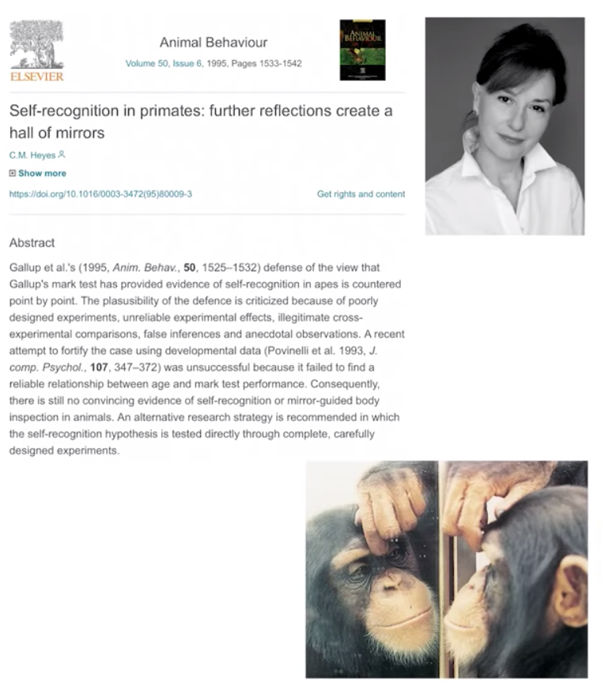

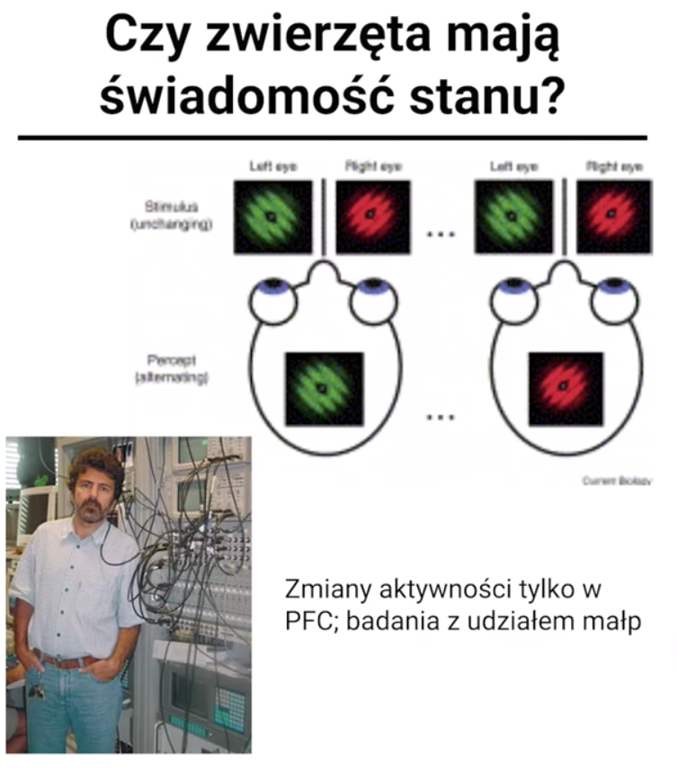

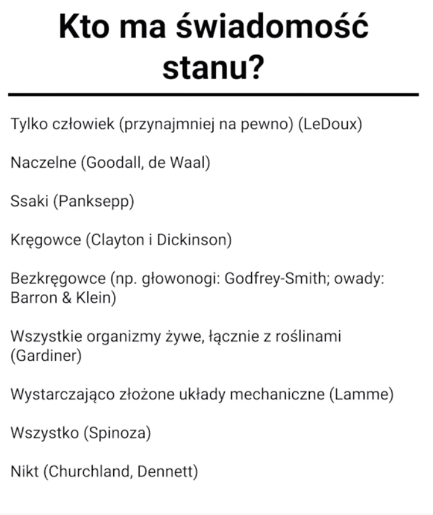

