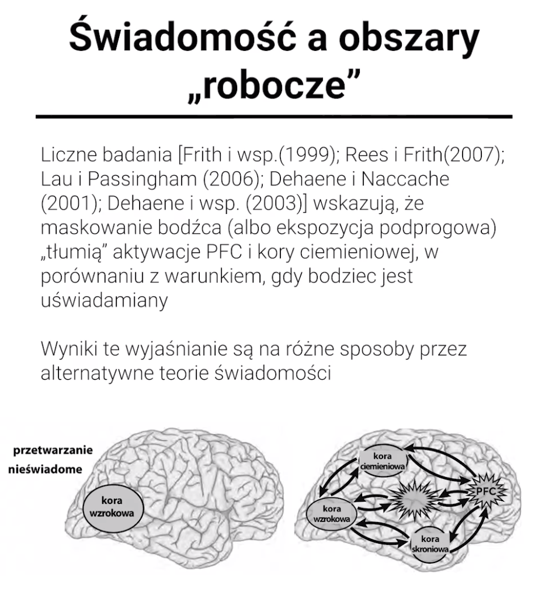

# Świadomość

Stan minimalnej świadomości  
Kiedy świadomość != przytomność

Inteligentne działanie -&gt; działanie celowe

I lecimy dalej:  
intuicje za: Edmund Rolls i Andy Clark - to język, syntaksa, umożliwia nam projektowanie, wybieganie w przyszłość, analizowanie, budowanie historii, których \(jeszcze\) nie ma.  
Zbudujmy wtedy nowy język narracji, nową syntaksę - twierdzenie Shapiro Whorfa 100% -&gt; Arrival

W pierwszej części niniejszego wykładu \(którego tematem była psychologia świadomości\) rozróżniliśmy dwa podstawowe typy świadmości: świadomość podmiotową oraz świadomość stanu. Omówiliśmy w tym kontekście słenne badania Adriana Owena i wsp. \(2006\), wskazujące że osoby nieprzytomne niekoniecznie są całkowicie nieświadome. W części drugiej wprowadziliśmy za Weiskrantzem i Dennettem kryterium świadomości stanu, jakim jest zdolność do sprawozdań werbalnych. Następnie przyjrzeliśmy się podstawowym metodom pomiaru świadomości, takim jak maskowanie \(wsteczne, metakontrastem\), obrazy bistabilne, prymowanie podprogrowe. Wreszcie, omówiliśmy relację między językiem i świadomością w głębszej perspektywie, wskazując, za uczonymi takimi jak Rolls, Clark i Dennett, że język umożliwia nie tylko sprawozdanie świadamianych treści, ale - w jakiejś mierze - tworzy samo świadome doświadczenie. W części trzeciej zajęliśmy się problemem świadomości stanu zwierząt innych niż człowiek. W tym celu omówiliśmy "test lustra" Gallupa, którego pozytywny wynik \(rozpoznawanie się w lustrze\) interpretowany jest za argument na rzecz samoświadomości danego zwierzęcia \(gatunku zwierząt\). Przyjrzeliśmy się również zarzutom wobec tego poglądu, a także alternatywnej metodzie testowania świadomości - z wykorzystaniem zjawiska rywalizacji obuczonej. W części czwartek przyjrzeliśmy się kilku najbardziej reprezentatywnym ze współczesnych psychologicznych teorii świadomości, m.in. teorii globalnej przestrzeni roboczej, rozwijanej przez Dehaene'a \(aby informacja została uświadomiona musi dojść do szeregu transmisji i retransmisji między pamięcią roboczą i różnymi systemami poznawczymi\), teorii myśli wyższego rzędu Rosenthala \(aby być świadomym czegoś, konieczne są dwie reprezentacje: nieświadoma reprezentacja bodźca \[niższego rzędu\] i reprezentacja \[wyższego rzędu\], powstająca w wyniku „myślenia” o reprezentacji niższego rzędu\) oraz teorii myśli pierwszego \(tego samego\) rzędu Blocka \(fenomenalnie doświadczamy wszystkich bodźców, które zostaną przetworzone, i w tym sensie nie ma konieczności istnienia myśli wyższego rzędu, ale musimy zyskać do nich jeszcze dostęp\). W części piątek przyjrzeliśmy się tym teoriom przez pryzmat danych neuronaukowych, wskazując, że choć obecne dane nie rozstrzygają jednoznacznie, która z tych teorii jest "najlepsza" dla percepcyjnej świadomości wzrokowej najistotniejszą rolę odgrywają dwukierunkowe sieci łączące korę wzrokową, ciemieniową i przedczołową.

