# Źródła danych w psychologii poznawczej

Eksperymenty behawioralne \(metoda chronometryczna\) i modele komputerowe.

Metoda chronometryczna: głównie założenie, w oparciu o to, że umysł jest systemem przetwarzającym informacje, jest to, że dokonuje się to w czasie.

Trzy typy reakcji \(Donders\):  
Reakcja prosta - jest bodziec, jest reakcja   
Reakcja typu go/no go - jest bodziec, jest jego weryfikacja, jest reakcja \(np. światło czerwone i zielone, a ja mam klikać tylko na zielone\)  
Reakcja z wyborem - jest bodziec, jest jego weryfikacja, jest wybór, jest reakcja \(np. światło czerwone i zielone, w zależności od tego, jakie się zapali, ja taki wybieram przycisk\)

Im łatwiej jest coś wyobrażalne, tym krótszy czas reakcji.  
Herbata  
Inteligencja  
Nasz umysł łatwiej przetwarza informacje konkretne, niż abstrakcyjne 

Efekt prymowania: wcześniejszy bodziec ma wpływ na kolejny - szybciej zareagujemy na lekarza, jeżeli wcześniej widzieliśmy strzykawkę, niż na lekarza, jeżeli wcześniej mieliśmy do czynienia z traktorem.

Nasz umysł funkcjonuje jak sieć - przechowuje pojęcia w sposób uporządkowany 

Efekt Stroopa: trzeba wyhamować - pojawia się konflikt poznawczy. Mierzymy, ile czasu nam zajmuje rozwiązanie tego konfliktu

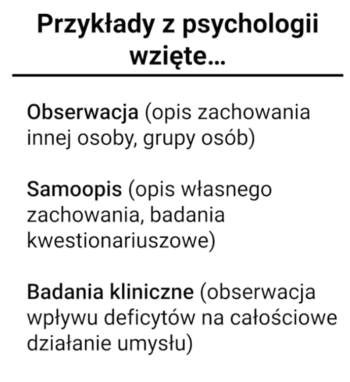

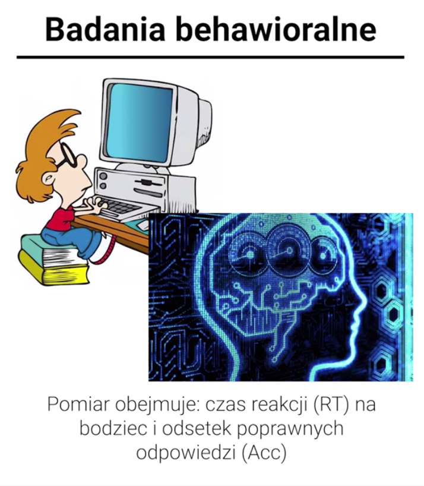

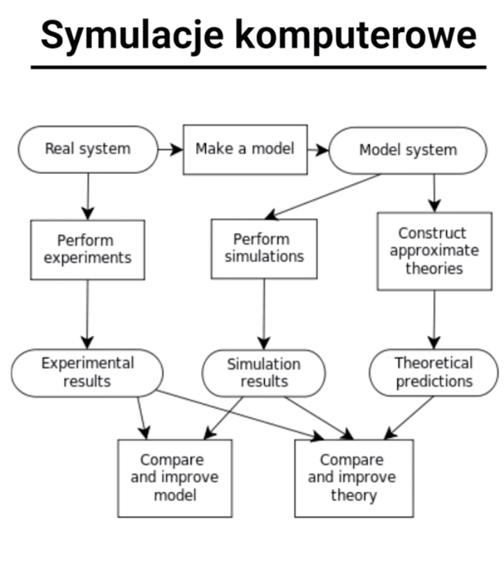

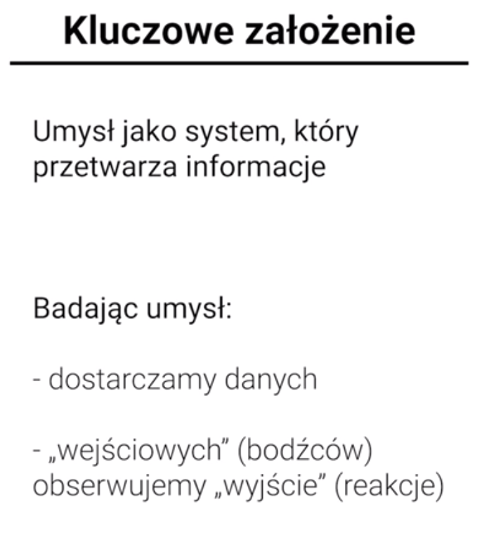

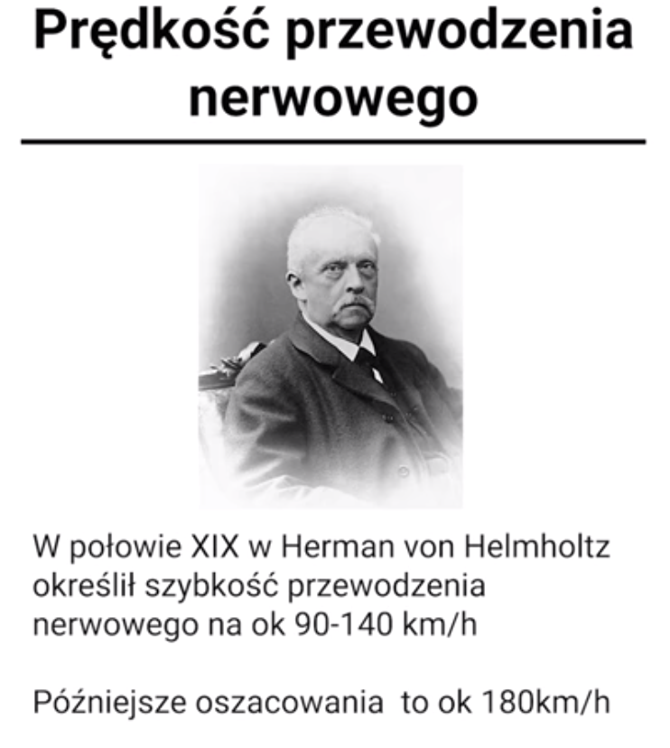

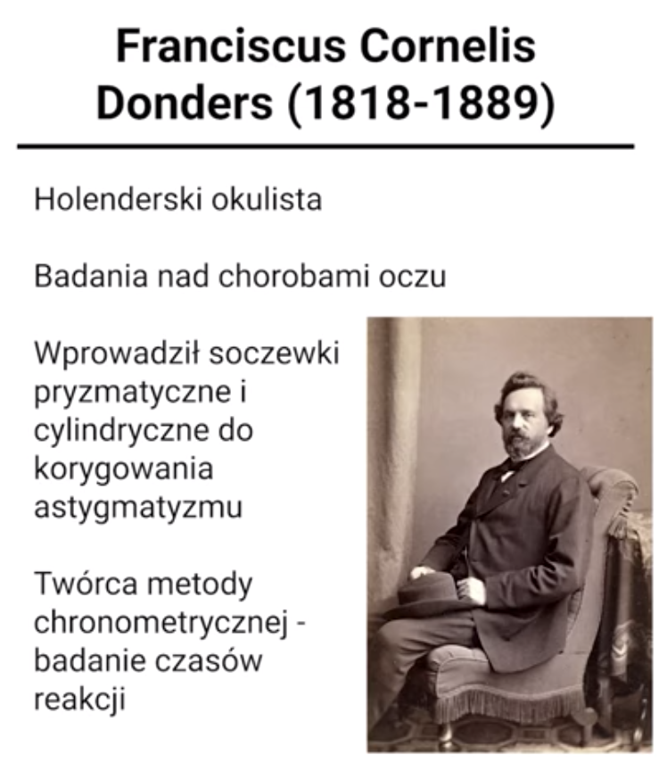

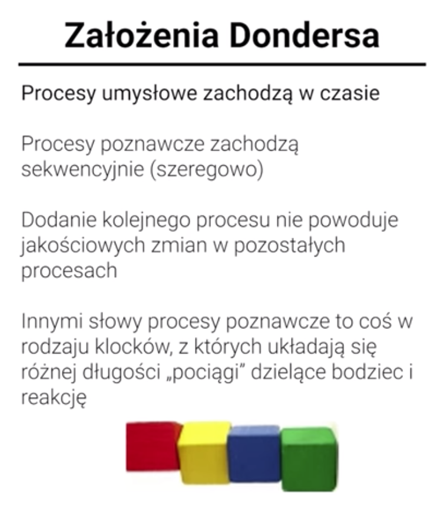

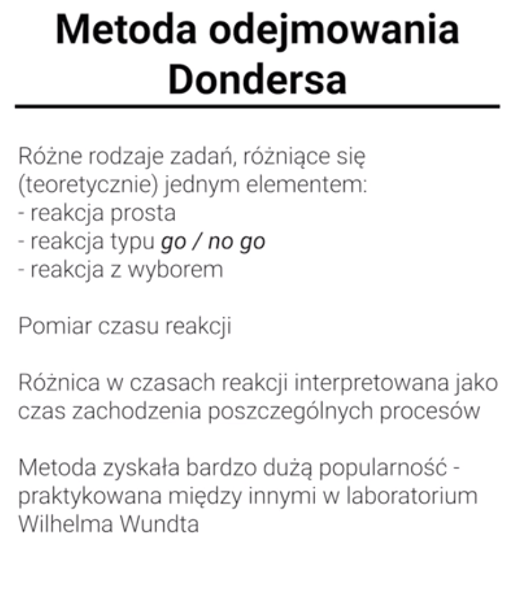

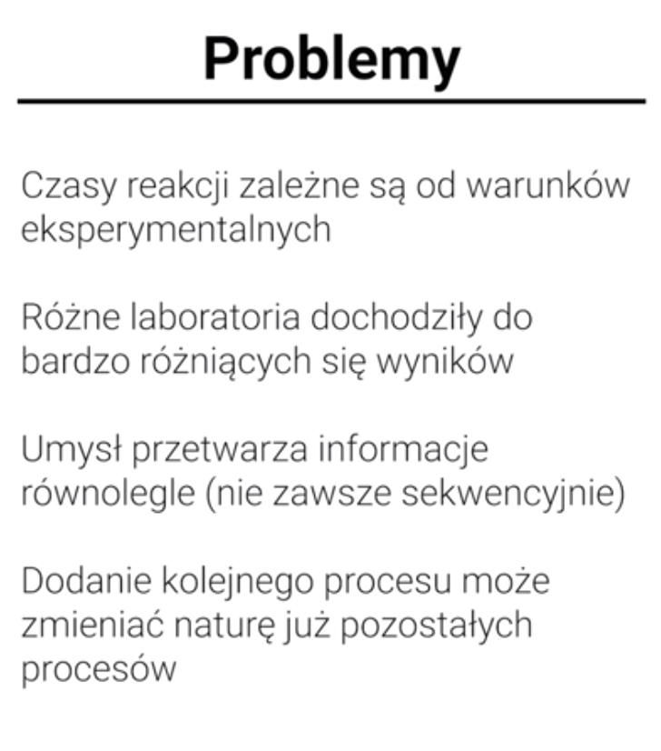

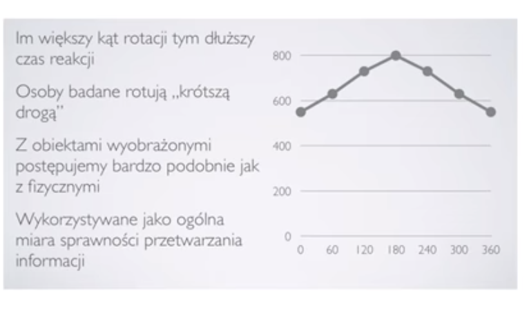

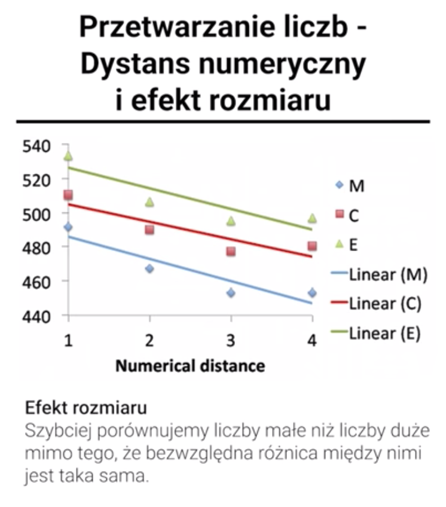

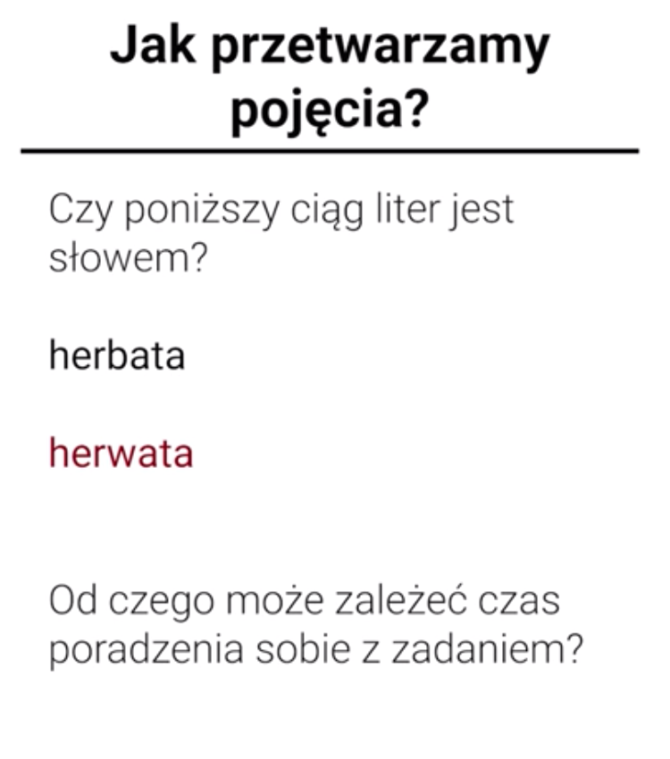

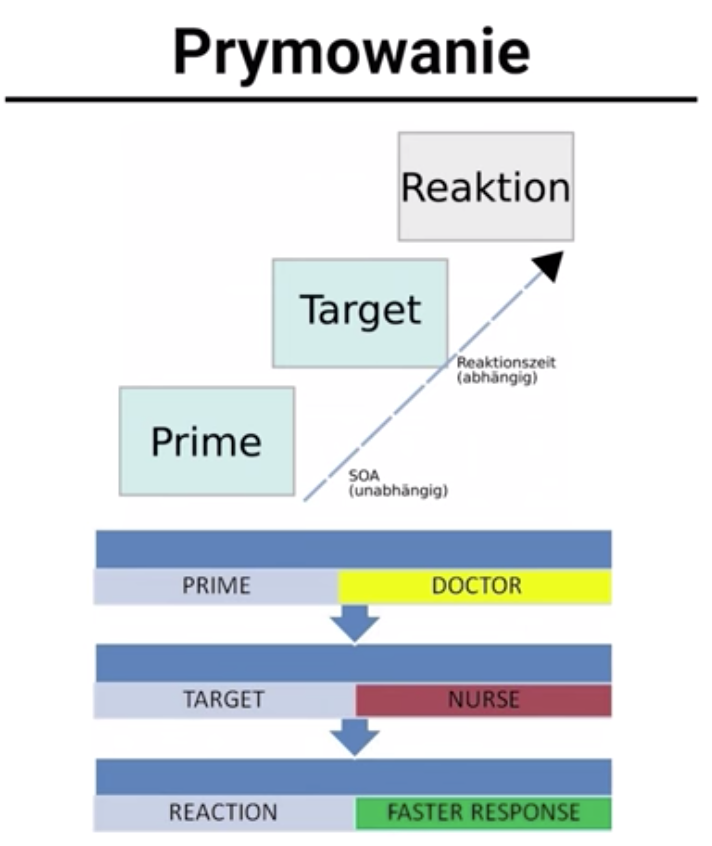

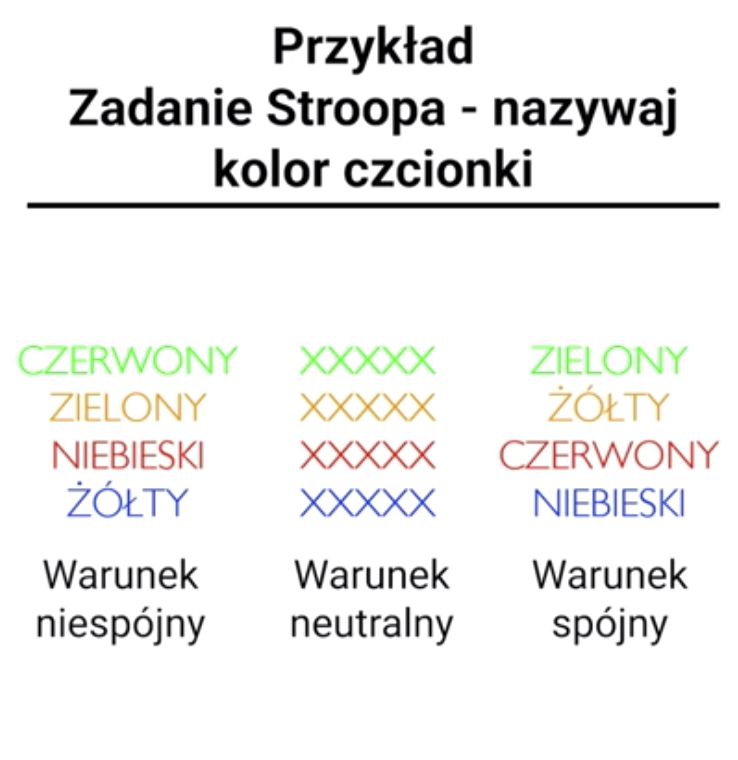

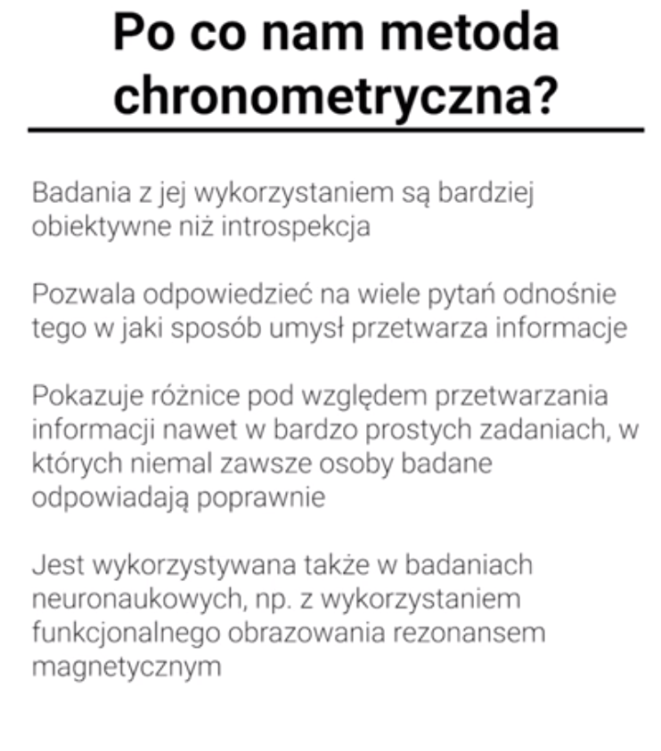

