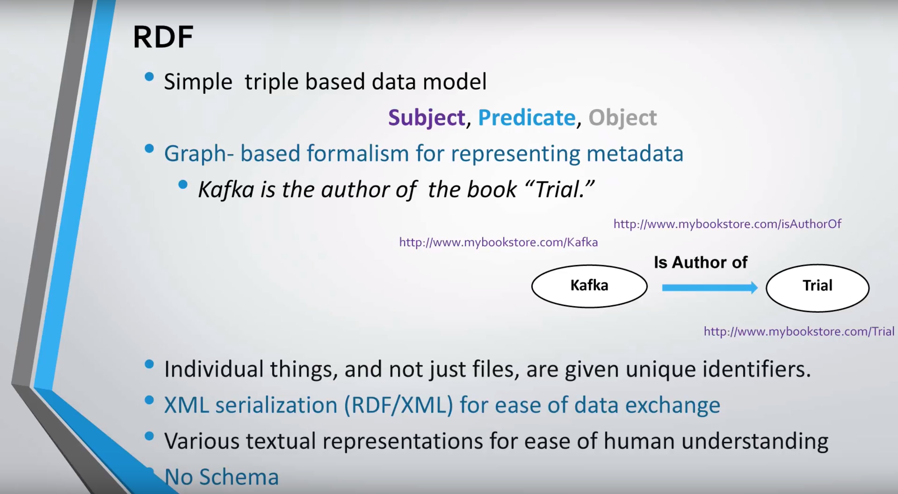
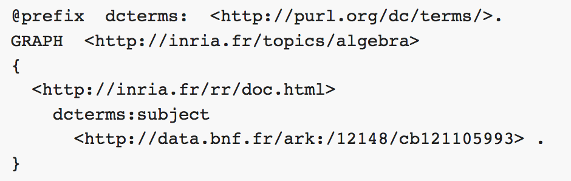

# RDF

### Resources






### About RDF



The RDF model is an oriented labeled multi-graph model:

* RDF triples form a graph when getting connected on common subjects or objects. The vertices of an RDF graph are the resources which are the subjects or objects of RDF triples, and its edges are labeled by the properties of the RDF triples.
* Two resources can be linked by several properties; an RDF graph is therefore a multi-graph.
* Vertices are labeled by URIs or literal values, and edges are labeled by URIs identifying properties.
* Edges are oriented: the tail of an edge is the subject of a triple, and the head of an edge is the object of a triple.

### **Composition rules for RDF triples**

1. The subject is always a resource \(and not a literal\)
2. The type of the binary property is identified by a URI
3. The value is a resource or a literal

### **The RDF model is an oriented labeled multigraph model**

1. multigraph: several edges can connect the same two nodes
2. oriented: the head of an edge is the object of the corresponding triple, its tail is the subject of the triple
3. labeled: edges and nodes are labeled by resources and literals

**A resource is either a URI or an anonymous resource \(blank node\)**

### **Syntax**

**RDF 1.1. comes with 7 syntaxes:**

* N-Triples,
* Turtle,
* RDF/XML,
* RDFa,
* JSON-LD,
* TriG,
* N-Quads

**An example RDF graph in the N-Triples syntax**

```text
<http://inria.fr/rr/doc.html>  <http://inria.fr/schema#author>  <http://ns.inria.fr/catherine.faron#me> .
<http://inria.fr/rr/doc.html> <http://inria.fr/schema#topic> "Web of Data" .
<http://inria.fr/rr/doc.html> <http://inria.fr/schema#topic> "Semantic Web" .
```

**An Example RDF graph in the Turtle syntax**

```text
@prefix rdf: <http://www.w3.org/1999/02/22-rdf-syntax-ns#>.
@prefix inria: <http://inria.fr/schema#> .
<http://inria.fr/rr/doc.html>  inria:author <http://ns.inria.fr/catherine.faron#me> ;
     inria:topic "Web of Data" , "Semantic Web" .
```

**An example RDF graph in the RDF/XML syntax**

```text
<rdf:RDF xmlns:rdf="http://www.w3.org/1999/02/22-rdf-syntax-ns#" xmlns:inria="http://inria.fr/schema#" >
    <rdf:Description
rdf:about="http://inria.fr/rr/doc.html">
        <inria:author rdf:resource=
"http://ns.inria.fr/catherine.faron#me"/>
        <inria:topic>Web of Data</inria:topic>
        <inria:topic>Semantic Web</inria:topic>
    </rdf:Description>
</rdf:RDF>
```


### **Datatype hierarchy**


### **Naming Graphs**



This RDF statement is expressed in TriG. It consists in an RDF triple which declares that document doc.html is about arithmetic sequences \(identified by [http://data.bnf.fr/ark:/12148/cb121105993](http://data.bnf.fr/ark:/12148/cb121105993) in the BNF\) but also in the encapsulation of this RDF triple within a named graph \(identified by [http://inria.fr/topics/algebra](http://inria.fr/topics/algebra)\) which presumably groups Inria's documents about Algebra.


